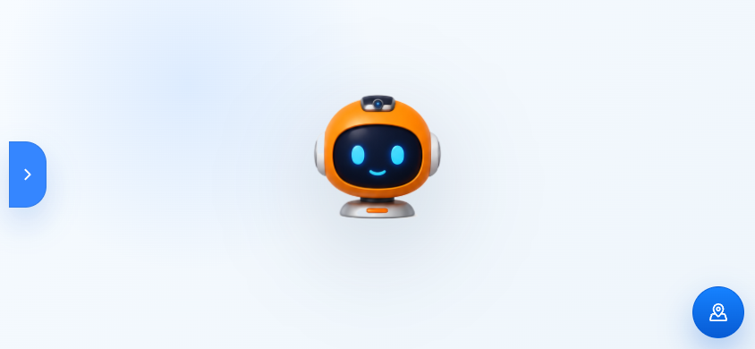
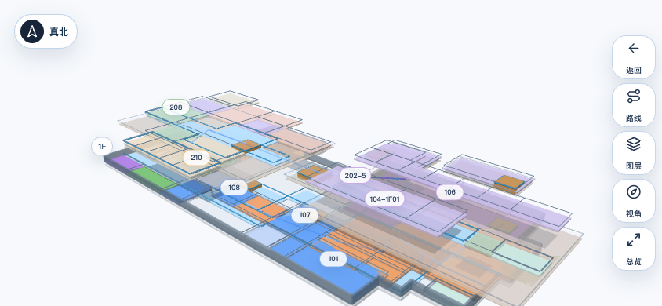
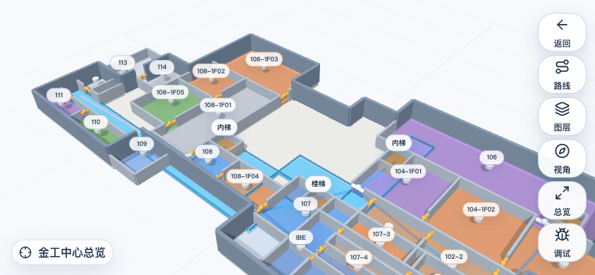
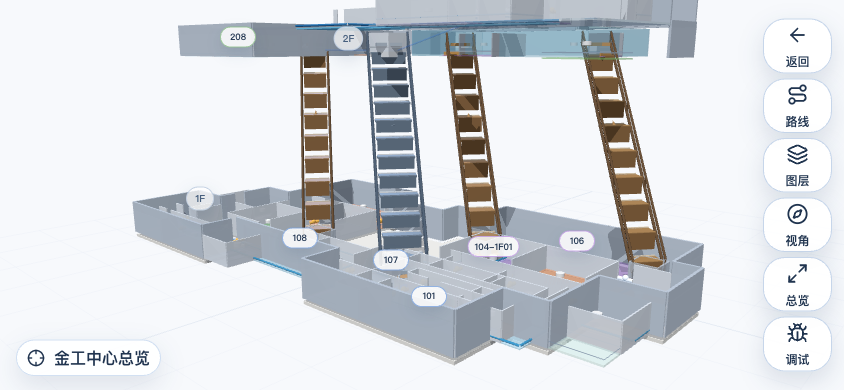
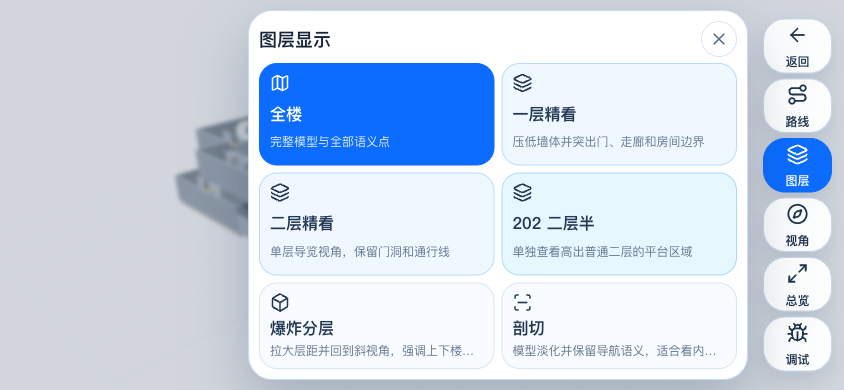
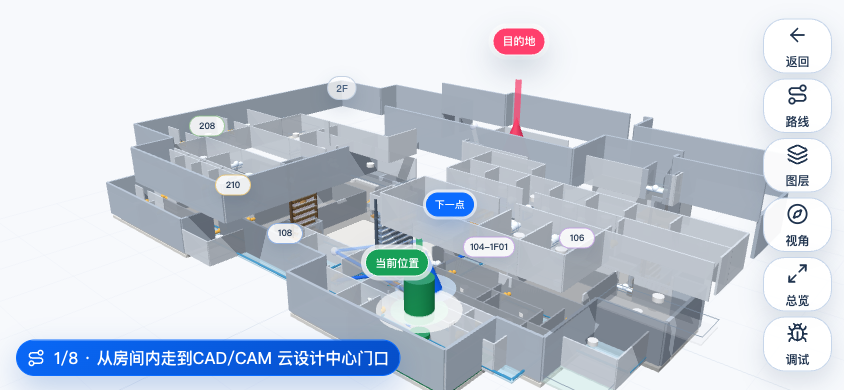
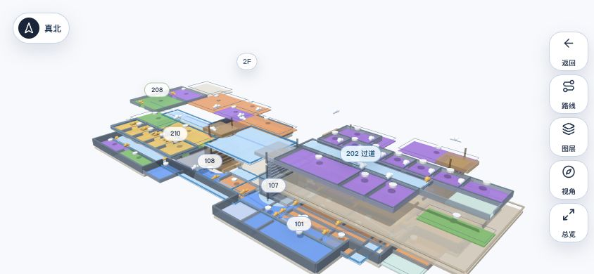
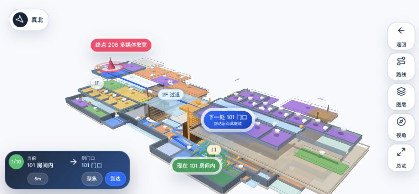

<a id="readme-top"></a>

<div align="center">
  

  <h1>金工小子</h1>

  <p>
    面向工程训练中心机器人头部横屏触控终端的地图、对话与后端指令展示应用。
  </p>

  <p>
    <a href="README.en.md">English</a>
    ·
    <a href="#quickstart"><strong>快速启动</strong></a>
    ·
    <a href="#proof"><strong>验证证据</strong></a>
    ·
    <a href="#gallery"><strong>真实截图</strong></a>
    ·
    <a href="#backend"><strong>后端接入</strong></a>
    ·
    <a href="#release"><strong>发布版本</strong></a>
  </p>

  <p>
    <a href="https://github.com/zzw4257/jingongxiaozi/releases/tag/v0.1.0-map-structure-20260607"></a>
    <a href="https://github.com/zzw4257/jingongxiaozi/releases/tag/v0.1.0-map-structure-20260607"></a>
    
    
    
    
    
    
    
    
    
    
    
  </p>

  <sub>上图是品牌概念图；下面全部产品界面图来自真实横屏运行截图。</sub>
</div>

<a id="overview"></a>

## 项目定位

金工小子是给机器人头部嵌入式屏幕使用的现场导览应用。默认交互对象不是桌面用户，而是在横屏触控面板前快速看路、听指引、切换地图层级的人。

当前主线已经从旧的矩形拼块地图升级为真实 3D 地图：运行时使用 `public/map-models/jingong.glb` 作为视觉模型，使用结构化房间、走廊、门、楼梯、2.5 层平台和导航拓扑作为语义源。旧版手工地图保留为隐藏演示入口，不作为默认地图。

核心目标很明确：

- 打开即是横屏触控体验，而不是桌面网页缩小版。
- 地图结构必须闭合、分层一致、走廊和房间可读。
- 路线必须按门、走廊、楼梯和平台分段，不允许穿墙直连。
- 后端只需要发送目标房间，不需要关心地图坐标。
- 小程序分支使用包内 WebGL 和同一份地图数据，不依赖 `localhost` 或 H5 服务。

<a id="proof"></a>

## 验证证据

<p align="center">
  
  <br><sub>真实 H5/移动端横屏截图：从 101 到 202-5，经过公共楼梯和 202 二层半平台。</sub>
</p>

| 验收项 | 当前证据 |
| --- | --- |
| 地图数据规模 | `53 rooms`, `53 door segments`, `80 spaces`, `16 centerlines` |
| 闭合空间 | `npm run check:map` 内执行 `scripts/verify-geometry.mjs` |
| 路线约束 | `101 -> 104-2F01` / `101 -> 108-2F04` 必走内部楼梯；`101 -> 202-5` 必走公共楼梯和 202 平台 |
| 模型资产 | `jingong.glb` 主模型、`jingong-fallback.glb` 备用模型通过 `scripts/verify-model-assets.mjs` |
| 模型校准 | `16 control points`, `max error 0.000`, `avg error 0.000`, `53 doorways` |
| H5 构建 | `npm run build` 通过 TypeScript 和 Vite 生产构建 |
| 小程序壳 | `npm run check:miniprogram` 阻止 WebView、localhost、全图 PNG 贴图回退 |
| 发布 APK | 发布附件为 arm64-v8a APK，SHA-256 见发布页 |

<a id="gallery"></a>

## 真实截图

<table>
  <tr>
    <td width="50%"><br><sub>待机页：机器人表情作为第一视觉中心。</sub></td>
    <td width="50%"><br><sub>地图总览：完整 3D 结构、楼层关系和导航入口。</sub></td>
  </tr>
  <tr>
    <td width="50%"><br><sub>一层单层：房间、走廊、楼梯和服务空间分区。</sub></td>
    <td width="50%"><br><sub>二层单层：独立二层、公共二层和 202 平台语义分离。</sub></td>
  </tr>
  <tr>
    <td width="50%"><br><sub>202 二层半：平台与下方承托结构同时可读。</sub></td>
    <td width="50%"><br><sub>爆炸分层：只改变视觉表达，不改变导航拓扑。</sub></td>
  </tr>
  <tr>
    <td width="50%"><br><sub>图层面板：横屏触控下的分层切换和地图控制。</sub></td>
    <td width="50%"><br><sub>104 独立二层路线：必须经过 104 内部楼梯。</sub></td>
  </tr>
  <tr>
    <td width="50%"><br><sub>小程序默认地图：包内 WebGL，不依赖外部 H5 服务。</sub></td>
    <td width="50%"><br><sub>小程序路线页：与移动端共用地图数据和路线语义。</sub></td>
  </tr>
</table>

<a id="quickstart"></a>

## 快速启动

```bash
npm install
npm run dev
```

常用入口：

```text
http://127.0.0.1:5173/?mode=map
http://127.0.0.1:5173/?mode=map&targetRoomId=202-5&announce=summary,distance,direction,floorChange
http://127.0.0.1:5173/?mode=map&targetRoomId=104-2F01&announce=summary,distance,floorChange
```

生产构建：

```bash
npm run check:map
npm run build
```

<a id="map-system"></a>

## 地图系统

```text
3DS / STL / SKP / DWG 原始资产
        |
        v
public/map-models/jingong.glb
        |
        v
modelAlignment + mapData 闭合空间语义
        |
        +--> H5 / Tauri Three.js 场景
        |
        +--> 微信小程序包内地图数据
```

地图不是单纯画平面图，而是围绕真实行走导引设计：

- **闭合空间**：每个可见区域必须归类为房间、走廊、楼梯、卫生间、服务空间、仓储、预留、承托或 void。
- **门优先路线**：房间中心 -> 门 -> 走廊中心线 -> 楼梯或平台 -> 门 -> 目标中心。
- **独立二层**：`104 / 106 / 108` 二层不能通过公共楼梯直达。
- **202 二层半**：`202-5` 作为 2.5 层平台目标，并保留下方承托语义。
- **动态标签**：远景保持稀疏，近景和单层视图展开更多房间标签。
- **分层安全**：爆炸分层只影响展示，不改变真实导航拓扑。

<a id="modes"></a>

## 应用模式

| 模式 | 用途 |
| --- | --- |
| 待机 | 纯机器人表情展示，适合嵌入式空闲状态 |
| 对话 | 大字号回复展示，不提供屏幕输入口 |
| 专家 | 回复加引用卡片，面向检索增强回答 |
| 地图 | 全屏 3D 导航、图层控制、路线引导和触控相机 |
| 后端调试 | 折叠入口，用于测试后端指令注入 |

<a id="backend"></a>

## 后端接入

后端不需要发送坐标，只发送一个类型化指令。地图导航使用 `MapDirectRequest`：

```js
window.jingongApplyDirective({
  type: "map",
  request: {
    targetRoomId: "202-5",
    announce: ["summary", "distance", "direction", "floorChange"]
  }
});
```

稳定接口约束见 [`docs/backend-integration-contract.md`](docs/backend-integration-contract.md)。

<a id="miniprogram"></a>

## 微信小程序

小程序分支位于 [`miniprogram/`](miniprogram/)，当前目标是与移动端地图保持数据和视觉策略一致：

- 不使用 `web-view`
- 不依赖 `localhost`
- 不依赖 `5173`
- 不用整张地图 PNG 贴图冒充 WebGL
- 不用产品可见的原生 polygon 叠层替代 Three 场景

检查命令：

```bash
npm run sync:miniprogram:map
npm run check:miniprogram
npm run check:miniprogram:parity
```

正式上传前仍需要真实微信小程序 AppID：

```bash
npm run check:miniprogram:release
```

<a id="release"></a>

## 发布版本

当前 GitHub 发布版本：

- [`v0.1.0-map-structure-20260607`](https://github.com/zzw4257/jingongxiaozi/releases/tag/v0.1.0-map-structure-20260607)
- APK 文件：`jingong-xiaozi-v0.1.0-map-structure-20260607-arm64.apk`
- ABI：`arm64-v8a`

Android arm64 构建命令：

```bash
npm run tauri -- android build --apk --target aarch64 --ci
```

发布候选必须通过：

```bash
npm run check:map
npm run check:miniprogram
npm run check:miniprogram:parity
npm run build
cd src-tauri && cargo check
npm run tauri -- android build --apk --target aarch64 --ci
```

<a id="repo-map"></a>

## 目录导览

| 路径 | 作用 |
| --- | --- |
| [`src/features/map3d/`](src/features/map3d/) | H5/Tauri Three.js 地图场景、相机、标签和路线渲染 |
| [`src/features/map/data/mapData.ts`](src/features/map/data/mapData.ts) | 房间、空间、门、楼梯、中心线和路线图 |
| [`src/features/map/runtime.ts`](src/features/map/runtime.ts) | 共享路线与地图运行时逻辑 |
| [`public/map-models/`](public/map-models/) | 运行时 GLB 模型与贴图 |
| [`miniprogram/`](miniprogram/) | 自包含微信小程序分支 |
| [`scripts/`](scripts/) | 地图、模型、校准、小程序和 QA 验证脚本 |
| [`docs/backend-integration-contract.md`](docs/backend-integration-contract.md) | 后端 directive 与 MapDirect 接口 |
| [`docs/releases/`](docs/releases/) | 发布说明与验证记录 |

<a id="verification"></a>

## 验证命令

```bash
npm run check:geometry
npm run check:model
npm run check:alignment
npm run check:map
npm run check:miniprogram
npm run check:miniprogram:parity
npm run build
cd src-tauri && cargo check
```

`npm run qa:mobile` 需要可选 Playwright 环境。

## 发布卫生

- 不提交 `env.txt`、Android 签名材料、本地浏览器缓存或 APK 构建产物。
- APK 通过 GitHub 发布附件分发，不进入源码历史。
- `models/` 下的源模型用于校准和参考，浏览器运行时使用生成后的 GLB。

<p align="right"><a href="#readme-top">回到顶部</a></p>
