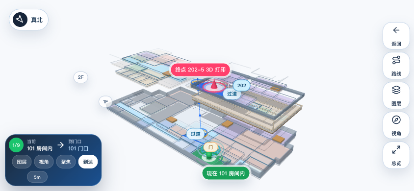
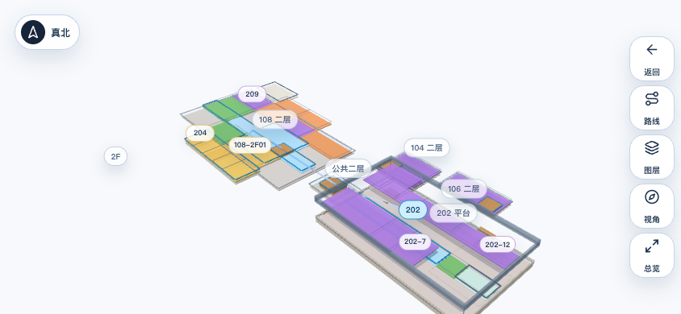
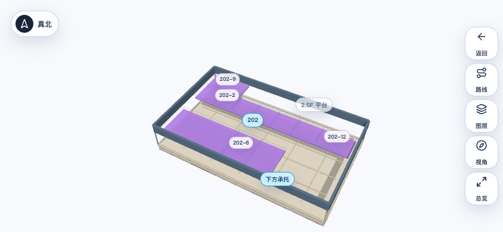

<a id="readme-top"></a>

<div align="center">
  

  <h1>金工小子</h1>

  <p>
    面向工程训练中心机器人头部横屏触控终端的地图、对话与后端指令展示应用。
  </p>

  <p>
    <strong>React + Tauri · Three.js 真实 3D 地图 · Android 横屏触控 · 微信小程序包内 WebGL · 后端 MapDirect 接入</strong>
  </p>

  <p>
    <a href="#get-started-in-60-seconds"><strong>快速启动</strong></a>
    ·
    <a href="#proof"><strong>验证证据</strong></a>
    ·
    <a href="#map-system"><strong>地图系统</strong></a>
    ·
    <a href="#backend-contract"><strong>后端接入</strong></a>
    ·
    <a href="#release"><strong>发布</strong></a>
  </p>

  <sub>上图是 README 品牌概念图；真实运行界面见下方 Playwright 截图。</sub>
</div>

## What It Is

金工小子是一个给机器人头部嵌入式屏幕使用的展示应用：默认是移动端横屏触控体验，核心能力是金工中心真实 3D 地图导航，同时保留待机、对话、专家回答、后端调试与微信小程序分支。

当前主线不是旧的矩形拼块地图。地图以 `public/map-models/jingong.glb` 为视觉源，以结构化房间、走廊、门、楼梯、2.5 层平台和导航拓扑为语义源；旧版手工地图只作为隐藏演示/回退入口存在。

## Proof

<p align="center">
  
  <br><sub>真实 H5/移动端横屏截图：从 101 到 202-5，经过公共楼梯和 202 二层半平台。</sub>
</p>

| Gate | Current Evidence |
| --- | --- |
| 地图数据 | `53 rooms`, `53 door segments`, `80 spaces`, `16 centerlines` |
| 闭合空间 | `npm run check:map` 内执行 `scripts/verify-geometry.mjs` |
| 路线约束 | `101 -> 104-2F01` / `101 -> 108-2F04` 必走内部楼梯；`101 -> 202-5` 走公共楼梯和 202 平台 |
| 模型资产 | `jingong.glb` 主模型、`jingong-fallback.glb` 备用模型通过 `scripts/verify-model-assets.mjs` |
| 模型校准 | `16 control points`, `max error 0.000`, `avg error 0.000`, `53 doorways` |
| H5 构建 | `npm run build` 通过 TypeScript 和 Vite 生产构建 |
| 小程序壳 | `npm run check:miniprogram` 阻止 WebView、localhost、全图 PNG 贴图回退 |

<p align="center">
  
  
  <br><sub>二层单层分区与 202 二层半平台：独立二层、公共二层、承托结构和路线语义分开表达。</sub>
</p>

## Get Started In 60 Seconds

```bash
npm install
npm run dev
```

Then open:

```text
http://127.0.0.1:5173/?mode=map
http://127.0.0.1:5173/?mode=map&targetRoomId=202-5&announce=summary,distance,direction,floorChange
http://127.0.0.1:5173/?mode=map&targetRoomId=104-2F01&announce=summary,distance,floorChange
```

For production web assets:

```bash
npm run check:map
npm run build
```

## Map System

```text
3DS/STL/SKP/DWG source assets
        |
        v
public/map-models/jingong.glb
        |
        v
modelAlignment + mapData closed spaces
        |
        +--> H5 / Tauri Three.js scene
        |
        +--> generated mini-program map data
```

The map is designed around physical navigation rather than drawing a pretty floor plan:

- **Closed spaces:** every visible region is classified as room, corridor, stair, restroom, service, storage, reserved, support, or void.
- **Door-first routing:** routes go room center -> door -> corridor centerline -> stair/portal -> door -> target center.
- **Independent second floors:** `104 / 106 / 108` upper spaces cannot be reached through the public stair.
- **202 raised platform:** `202-5` is treated as a 2.5F platform target with lower support context.
- **Mobile label density:** far views stay sparse; near/single-floor views expand labels and interaction detail.
- **Exploded view safety:** floor separation is visual only, so stairs are shown as paired portals instead of fake cross-offset stair bodies.

## Application Modes

| Mode | Purpose |
| --- | --- |
| Standby | Pure robot expression display for embedded idle state |
| Chat | Large answer display without an on-screen input box |
| Expert | Answer plus citation cards for retrieval-style responses |
| Map | Fullscreen 3D navigation, layer control, route guidance and touch camera |
| Backend debug | Folded entry for testing directive injection without dominating the product UI |

## Backend Contract

Backend services do not need to send coordinates. They send one typed directive and, for map navigation, a `MapDirectRequest`:

```js
window.jingongApplyDirective({
  type: "map",
  request: {
    targetRoomId: "202-5",
    announce: ["summary", "distance", "direction", "floorChange"]
  }
});
```

Stable contract details live in [`docs/backend-integration-contract.md`](docs/backend-integration-contract.md).

## Mini Program

The mini-program branch lives in [`miniprogram/`](miniprogram/) and is self-contained:

- no `web-view`
- no `localhost`
- no `5173`
- no full-map PNG screenshot fallback
- no product-visible native polygon overlay replacing the Three scene

Check it with:

```bash
npm run sync:miniprogram:map
npm run check:miniprogram
npm run check:miniprogram:parity
```

Formal release still requires a real WeChat Mini Program AppID:

```bash
npm run check:miniprogram:release
```

## Release

Android arm64 APK build path:

```bash
npm run tauri -- android build --apk --target aarch64 --ci
```

Historical May baseline:

- [`docs/releases/2026-05-31-precision-mobile.md`](docs/releases/2026-05-31-precision-mobile.md)
- `build/android-release/jingong-xiaozi-2026-05-31-precision-mobile-arm64.apk` when present locally

Current release candidates should pass:

```bash
npm run check:map
npm run check:miniprogram
npm run check:miniprogram:parity
npm run build
cd src-tauri && cargo check
npm run tauri -- android build --apk --target aarch64 --ci
```

## Repository Map

| Path | Role |
| --- | --- |
| [`src/features/map3d/`](src/features/map3d/) | H5/Tauri Three.js map scene, camera, labels, route rendering |
| [`src/features/map/data/mapData.ts`](src/features/map/data/mapData.ts) | Rooms, spaces, doors, stairs, centerlines and route graph |
| [`src/features/map/runtime.ts`](src/features/map/runtime.ts) | Shared route and map runtime logic |
| [`public/map-models/`](public/map-models/) | Runtime GLB models and textures |
| [`miniprogram/`](miniprogram/) | Self-contained WeChat Mini Program branch |
| [`scripts/`](scripts/) | Map, model, alignment, mini-program and QA verification scripts |
| [`docs/backend-integration-contract.md`](docs/backend-integration-contract.md) | Backend directive and MapDirect contract |
| [`docs/releases/`](docs/releases/) | Release notes and validation anchors |

## Verification Commands

```bash
npm run check:geometry
npm run check:model
npm run check:alignment
npm run check:map
npm run check:miniprogram
npm run check:miniprogram:parity
npm run build
cd src-tauri && cargo check
```

`npm run qa:mobile` is available when the optional Playwright package is installed.

## Notes

- This repository is currently private-to-project in practice even though the GitHub target repository is public. Do not commit `env.txt`, Android signing secrets, or local browser cache.
- Build artifacts, screenshots and APKs are intentionally ignored by default; release assets are uploaded through GitHub releases instead of kept in source history.
- Model source files under `models/` are calibration/reference assets; browser runtime uses generated GLB assets.

<p align="right"><a href="#readme-top">Back to top</a></p>
