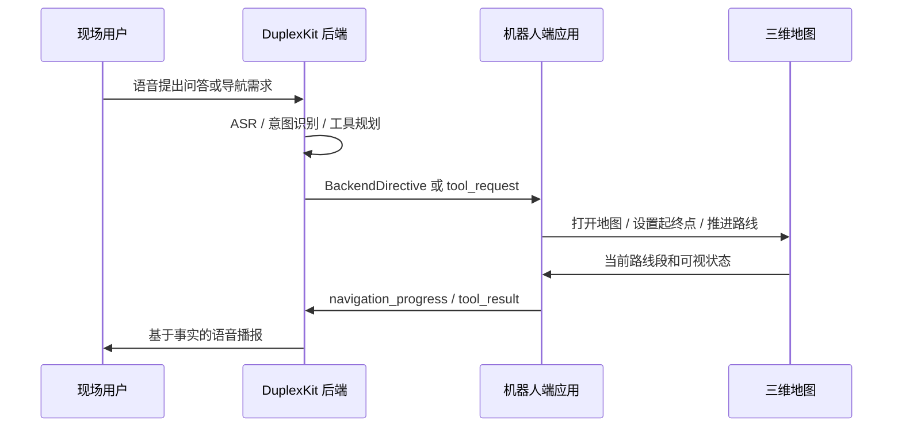

# 后端接口约束摘要

## 职责边界

前端负责展示、地图、触控、路线计算和状态切换。后端负责麦克风、唤醒过滤、语音识别、意图识别、知识检索、LLM 生成、TTS、工具规划和导航事实播报。

| 链路 | 后端职责 | 前端职责 |
| --- | --- | --- |
| 唤醒 | 近场声音检测、唤醒阈值、噪声过滤 | 展示 wake / listening 状态 |
| ASR | 语音转文字、断句、打断识别 | 不显示输入框，只展示聆听反馈 |
| 意图识别 | 判断问答、专家检索、地图导航 | 接收明确 `BackendDirective` |
| 普通问答 | 生成回答、TTS 播放 | 展示回答和关键词 |
| 专家问答 | 检索知识库、生成引用 | 展示答案、关键词和引用卡片 |
| 地图导航 | 解析房间意图、生成 roomId，消费导航进度事实 | 打开地图、计算路线、支持手动/语音继续操作 |

前端不反向控制后端音频链路，不持有麦克风，不决定语音意图。后端也不直接编造路线距离、预计时间和下一节点；这些事实由前端地图根据当前路线回传。

该边界的核心是“智能表达”和“空间事实”分离。大模型适合理解用户自然语言、选择工具、组织简短播报；但房间是否存在、楼梯能否到达、还剩多少米、下一节点叫什么，必须来自应用端地图或后端工具结果。这样可以保留自然交互，同时避免导航幻觉。

## 端到端链路



这条链路支持两种推进方式：用户可以在地图上点击“下一步”，也可以用语音说“下一步”。两种方式都会更新同一个 `navigation_progress`，所以后端、移动端和小程序不会各自维护一套路线状态。

## 后端版本锁定

当前后端以 DuplexKit 子模块接入，并由主仓库锁定版本：

| 项 | 内容 |
| --- | --- |
| 仓库 | `https://github.com/ElysiaFollower/DuplexKit.git` |
| 分支 | `main` |
| 锁定提交 | `167b6a8861666b63c3bdcbf91567ef12fac5e7fd` |
| 锁定文件 | `docs/backend-duplexkit-version.json` |
| 验证脚本 | `npm run check:fullstack:contracts` |

更新后端时必须先提交并推送 DuplexKit，再更新锁定文件，不能把后端当作未版本化的本地目录。

## 应用状态

| 指令 | 展示状态 | 说明 |
| --- | --- | --- |
| `idle` | 待机 | 回到机器人表情展示 |
| `wake` | 唤醒反馈 | 检测到近场有效声音 |
| `listening` | 聆听中 | 等待完整语音请求 |
| `processing` | 理解中 | 后端判断目标任务 |
| `chat` | 常态对话 | 展示普通回答、关键词和播报状态 |
| `expert` | 专家问答 | 展示检索答案、关键词和引用 |
| `map` | 地图导航 | 打开地图并预填导航状态 |

## 稳定类型

权威类型位于 `src/shared/appTypes.ts`。

```ts
type BackendDirective =
  | { type: "idle"; emotion?: string }
  | { type: "wake"; level?: number; hint?: string }
  | { type: "listening"; hint?: string; level?: number }
  | { type: "processing"; hint?: string }
  | { type: "chat"; answer: string; keywords?: string[]; audio?: Partial<AudioChainState> }
  | { type: "expert"; answer: string; citations?: Citation[]; keywords?: string[]; audio?: Partial<AudioChainState> }
  | { type: "map"; request: MapDirectRequest; audio?: Partial<AudioChainState> }
```

```ts
type MapDirectRequest = {
  startRoomId?: string
  targetRoomId?: string
  announce?: Array<"summary" | "distance" | "direction" | "floorChange">
}
```

```ts
type AudioChainState = {
  input: "idle" | "wake" | "listening" | "processing"
  output: "idle" | "speaking"
  source: "none" | "touch" | "backend" | "mock"
  level?: number
  message?: string
}
```

## 注入入口

浏览器和 Tauri WebView 暴露两个等价入口。

```js
window.jingongApplyDirective({
  type: "map",
  request: {
    targetRoomId: "202-5",
    announce: ["summary", "distance", "direction", "floorChange"]
  }
})
```

```js
window.dispatchEvent(
  new CustomEvent("jingong:directive", {
    detail: {
      type: "chat",
      answer: "工程训练中心提供 CAD/CAM、3D 打印、焊接、数控加工等实践训练能力。",
      keywords: ["工程训练", "数控加工", "3D 打印"]
    }
  })
)
```

H5 / 小程序调试参数：

```text
/?mode=listening&hint=我在听，请说出需求
/?mode=chat
/?mode=expert
/?mode=map&targetRoomId=202-5&announce=summary,distance,direction,floorChange
/?mode=map&startRoomId=108-lobby&targetRoomId=104-2F01&announce=summary,distance
```

`mode=chat / expert / listening / map` 都是稳定 smoke-test 入口，用于后端联调、H5 验证和发布检查。

## 地图参数

| 参数 | 说明 |
| --- | --- |
| `startRoomId` | 起点房间 ID，缺省时由前端在需要路线时使用默认起点 `101` |
| `targetRoomId` | 终点房间 ID，可由语音意图、小程序入口或触控选择提供 |
| `announce` | 进入地图时默认展示的播报重点 |

后端只传房间 ID，不传几何坐标。坐标、门洞、走廊、楼梯、路线由前端地图拓扑服务计算。

## 后端工具声明

DuplexKit 对应用端公开的地图与导航工具至少包含：

| 工具 | 说明 |
| --- | --- |
| `map.open` | 打开地图，可带起点、终点和播报选项 |
| `map.close` | 关闭地图或回到主状态 |
| `map.set_origin` | 设置起点 |
| `map.set_destination` | 设置终点 |
| `navigation.start` | 启动导航 |
| `navigation.next` | 用户确认到达当前段下一节点后进入下一段 |
| `navigation.previous` | 回退上一段 |
| `navigation.status` | 查询当前段、下一节点、剩余距离和方向状态 |

这些工具由 `check:fullstack:contracts` 校验，不允许在后端演进中静默删除。

工具声明需要保持稳定，是因为前端、小程序和后端不是同一进程内的函数调用。只要工具名或参数含义漂移，语音导航就可能出现“后端以为已经开始导航，前端实际没有路线”的断裂。因此发布前必须通过 `check:fullstack:contracts`，确认工具、远端后端提交、锁定文件和发布脚本一致。

## 导航事实

前端地图在路线执行过程中回传 `navigation_progress`。后端回答“还要走多远”“下一步去哪”“现在到哪一段”等问题时，只能依据该结构化事实：

| 字段 | 含义 |
| --- | --- |
| `activeLegIndex` / `totalLegs` | 当前第几段和总段数 |
| `fromLabel` | 当前节点 |
| `checkpointLabel` | 下一门、楼梯口、转折点或目标 |
| `checkpointKind` | door / corridor / stair / room / destination |
| `distanceMeters` | 当前段距离 |
| `remainingMeters` / `remainingSeconds` | 剩余距离和预计时间 |
| `instruction` | 当前段简短导引 |
| `heading` | 方向传感器或真北反馈 |

当前 smoke 记录显示：当前段为 `101 门口 -> 走廊入口`，下一节点为 `走廊入口`，支持手动推进和语音推进。

后端生成自然语言时建议遵守：

| 场景 | 回答原则 |
| --- | --- |
| 当前段播报 | 只说当前段和下一检查点，避免一次性读完整路线 |
| 距离/时间 | 使用 `remainingMeters` / `remainingSeconds`，没有事实时说明暂未获取 |
| 方向 | 有传感器或校准值时说明朝向；没有时说明按地图真北显示 |
| 用户打断 | 先停止或降低当前播报，再处理新工具请求 |
| 房间别名 | 先映射到已知 roomId，再调用地图工具，不直接生成坐标 |

## 房间 ID 约束

| ID | 说明 |
| --- | --- |
| `101` | 默认起点，CAD/CAM 云设计中心 |
| `104-2F01` | 104 独立二层，必须经 104 内部楼梯 |
| `106-2F` | 106 独立二层，必须经 106 内部楼梯 |
| `108-2F04` | 108 独立二层钳工空间，必须经 108 内部楼梯 |
| `108-lobby` | 108 门厅，常用起点 |
| `202-5` | 202 二层半 3D 打印目标，走公共楼梯和 202 平台 |
| `208` | 二层多媒体教室，接入二层公共走廊 |
| `210` | 二层会议室，接入二层办公走廊 |

后端不得把公共楼梯当成 104 / 106 / 108 独立二层入口。

## 音频状态映射

| 后端事件 | 指令 | 前端显示 |
| --- | --- | --- |
| 近场声音触发 | `wake` | 待机页唤醒表情、音量波动 |
| 用户正在说话 | `listening` | 聆听中提示 |
| ASR 完成并理解中 | `processing` | 理解中提示 |
| 普通回答生成 | `chat` | 对话页答案和关键词 |
| 专家答案生成 | `expert` | 专家页答案、关键词、引用 |
| 地图意图确认 | `map` | 地图页和预填路线 |

## 接入验收

| 场景 | 验收点 |
| --- | --- |
| 普通问答 | `wake -> listening -> processing -> chat` 连续展示，TTS 播放时 `audio.output = speaking` |
| 专家检索 | `wake -> listening -> processing -> expert`，引用卡片存在 |
| 地图导航 | `map` 打开 `202-5`，用户可改起点、终点、图层和视角 |
| 内部楼梯 | `104-2F01` 和 `108-2F04` 路线不走公共楼梯直达 |
| 无后端输入 | 保持纯待机表情展示 |
| 小程序入口 | query 参数和移动端 `MapDirectRequest` 行为一致 |
| 导航进退 | `navigation.next`、`navigation.previous`、`navigation.status` 都能基于当前路线事实响应 |
| 房间目录 | 后端房间目录与前端 53 个房间保持一致 |
| 工具契约 | DuplexKit 远端、锁定提交和工具声明通过 `check:fullstack:contracts` |

## 后续接口扩展

| 方向 | 建议 |
| --- | --- |
| 语音打断 | 后端发送 `processing` 或新指令前先停止 TTS，前端只展示状态 |
| 当前位置 | 当前支持用户点击/语音推进路线段；后续可接入机器人定位自动推进 |
| 方向传感器 | 前端显示方向，后端可提供机器人朝向校准值 |
| 任务动作 | 机器人动作控制保持后端闭环，前端只显示动作状态 |
| 小程序消息桥 | 小程序 bridge 已支持工具请求和结果回传；复杂状态继续通过消息桥扩展，不通过 localhost |
