# 金工小子工程训练设计报告

面向青龙机器人顶部嵌入式终端的智能交互应用。最终形态是横屏触控屏 + 语音唤醒 + 后端智能系统 + 真实空间地图导航，同时保留独立移动端运行能力和微信小程序联动路径。

<p align="center">
  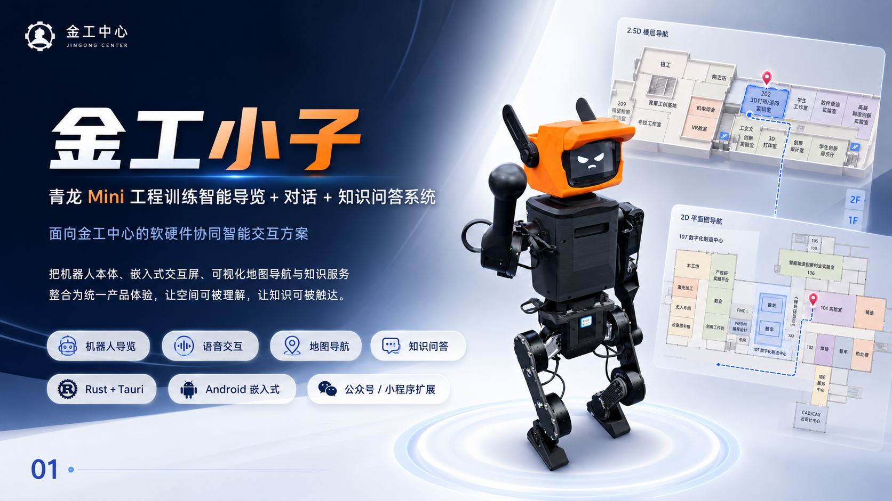
  <br>
  <sub>产品定位稿明确了机器人端展示、地图导航、常态对话、专家模式、Android 端和小程序联动的整体目标。</sub>
</p>

## 1. 需求端

### 1.1 工程训练场景

工程训练中心的空间组织复杂，使用者包含参观访客、上课学生、任课教师、设备管理人员和机器人维护人员。实际任务不是单次页面展示，而是让机器人能够在真实建筑内承担“听懂需求、展示状态、回答问题、指引空间”的入口角色。

项目服务的对象是青龙机器人。机器人本体具备移动、展示和互动属性，顶部终端承担主要人机界面；声控负责自然入口，触控负责确认、补充和纠错。工程训练课程要求强调系统集成、工程可行性、过程验证和最终交付，因此应用需要同时覆盖软件系统、真实空间、机器人硬件形态和后端智能链路。

<p align="center">
  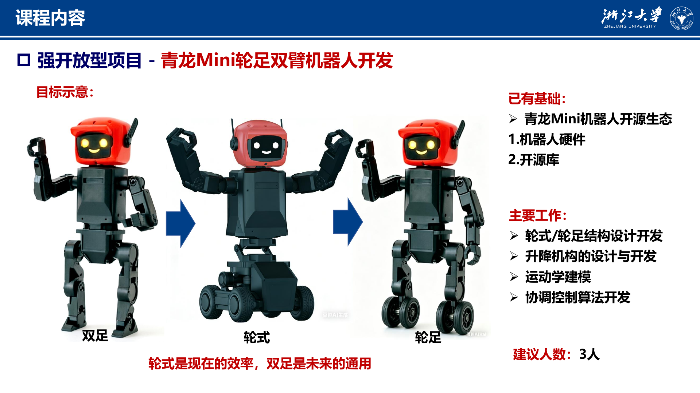
  <br>
  <sub>课程资料中的青龙 Mini 机器人方向为嵌入式展示端和机器人服务场景提供了工程背景。</sub>
</p>

### 1.2 初始输入

早期输入来自四类材料：

| 类型 | 代表资产 | 作用 |
| --- | --- | --- |
| 地图参考 | `导航模式图v1.png`、`导航模式图v2.png`、`示意图.jpg` | 提供 2D / 2.5D 视觉、房间卡片、路径卡片、筛选栏和跨层路线目标 |
| 空间标识 | `金工中心标识20260317-2.pdf` | 提供一层、二层房间名称、功能区和标识系统 |
| 机器人方案 | `金工小子设计稿.pptx` | 提供产品定位、机器人端状态、地图导航、专家问答和软件一体化方案 |
| 智能后端方案 | `设计方案.pdf` | 提供全双工语音、知识增强、动作协同、安全中断和软硬件资源约束 |

<p align="center">
  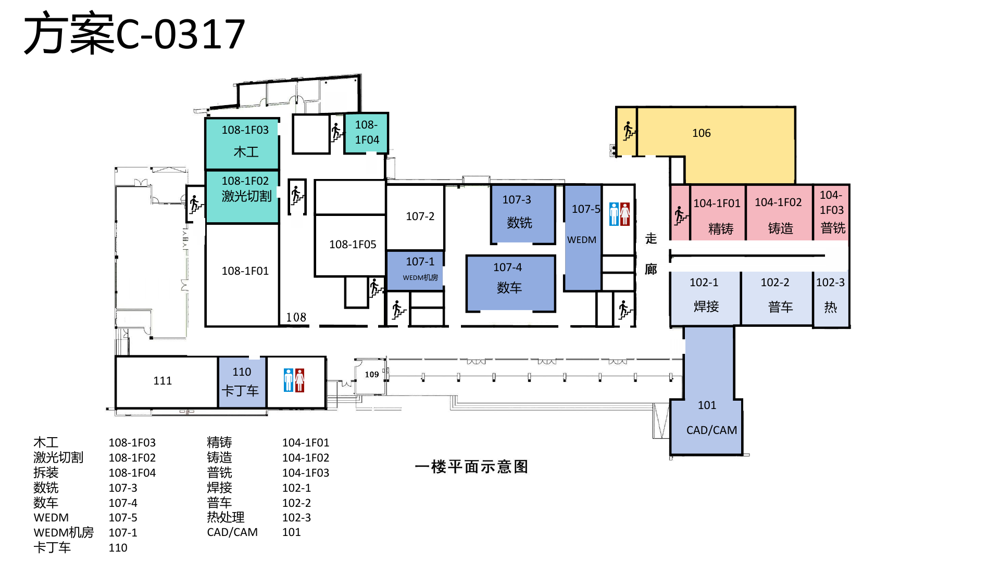
  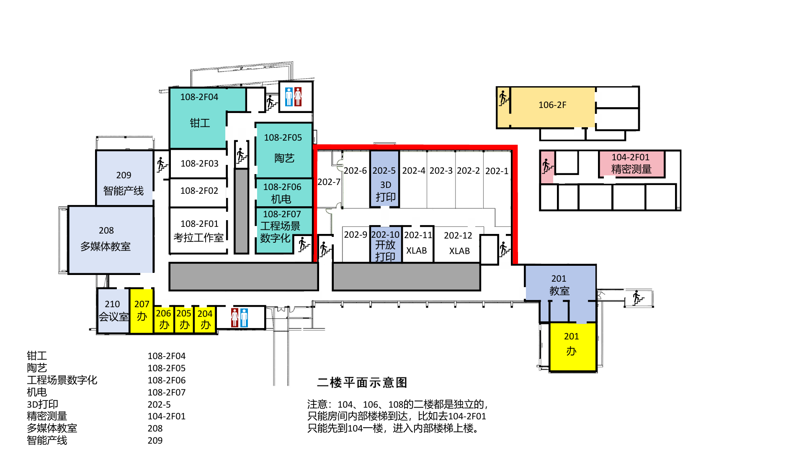
  <br>
  <sub>标识图提供了 101、104、106、107、108、202、208、209、210 等关键空间的命名和功能语义。</sub>
</p>

### 1.3 用户需求

需求可以拆成五个层级：

| 层级 | 需求 | 验收方式 |
| --- | --- | --- |
| 展示终端 | 默认状态安静、完整、适合机器人头部横屏展示 | 待机页只突出机器人表情和低干扰入口 |
| 声控入口 | 后端唤醒、聆听、理解、播报状态能被前端明确表达 | `wake -> listening -> processing -> chat/expert/map` 连续切换 |
| 地图导航 | 房间、走廊、门洞、楼梯、二层半和跨层路线可解释 | 路线必须按门、走廊、楼梯逐段生成 |
| 触控操作 | 横屏单手可操作，支持旋转、缩放、平移、图层、视角和路线推进 | Android 模拟器与 H5 横屏截图检查 |
| 跨端联动 | Android 主线、小程序入口和后端带参打开共享同一套语义 | `MapDirectRequest`、房间 ID、路线规则一致 |

地图需求的核心对象是“可通行关系”。房间中心、房间门、走廊中心线、楼梯口、平台和目标中心都需要成为可解释节点。路线不能穿墙，公共楼梯不能直达 104 / 106 / 108 的独立二层，202-5 需要按二层半平台处理。

### 1.4 约束条件

- 机器人顶部屏幕以横屏为主，第一屏必须打开即用。
- 触控栏、浮层和面板不能遮挡地图主体和路线端点。
- 地图需要保留展示性，同时支持真实查找房间。
- 后端音频链路独立演进，前端接收状态和指令，不接管麦克风与扬声器。
- 小程序发布版不能依赖 `5173`、localhost、公网 H5 临时服务或截图贴图。
- 真实模型优先级高于手写几何，PDF / DWG / SKP / 现场图用于补充语义和命名。

## 2. 设计方案

### 2.1 总体架构

技术栈采用 `Tauri 2 + Rust + React + TypeScript + Vite + Three.js`。Android 横屏端是主线，H5 负责快速调试，小程序走微信 WebGL + Three 适配路线。运行时新增依赖保持克制，3D 地图使用 `three`，图标使用 `lucide-react`，小程序适配使用 `three-platformize` 作为迁移方向。

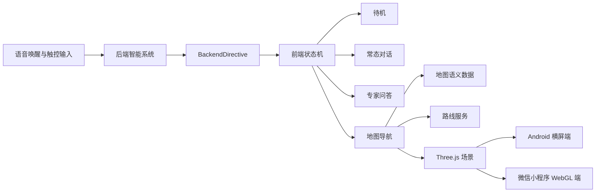

核心源码分层：

| 模块 | 文件 | 职责 |
| --- | --- | --- |
| 应用状态 | `src/shared/appTypes.ts`、`src/App.tsx` | 定义 `standby / chat / expert / map` 状态和后端指令入口 |
| 后端适配 | `src/backend-bridge/directives.ts` | 将 `BackendDirective` 转换成前端状态 |
| 3D 地图宿主 | `src/features/map3d/MapShell.tsx` | 默认进入真实 3D 地图，保留旧版地图入口 |
| 3D 地图主体 | `src/features/map3d/Map3DApp.tsx` | Three 场景、模型加载、触控、标签、路线、面板 |
| 模型对齐 | `src/features/map3d/modelAlignment.ts` | 楼层高度、2.5 层、爆炸分层、相机和模型坐标变换 |
| 语义数据 | `src/features/map/data/mapData.ts` | 房间、空间、墙体、门洞、楼梯、中心线、控制点 |
| 路线运行时 | `src/features/map/runtime.ts` | 路线计算、逐段导引、图层、标签密度和触控栏命中 |

### 2.2 应用状态机

应用只有四个主状态：`standby / chat / expert / map`。聆听是待机页内的子状态，避免屏幕上出现输入框和复杂对话控件。后端指令进入前端后，状态机只做展示切换，用户仍能继续触控操作。

```ts
type BackendDirective =
  | { type: "idle"; emotion?: string }
  | { type: "wake"; level?: number; hint?: string }
  | { type: "listening"; hint?: string; level?: number }
  | { type: "processing"; hint?: string }
  | { type: "chat"; answer: string; keywords?: string[]; audio?: Partial<AudioChainState> }
  | { type: "expert"; answer: string; citations?: Citation[]; keywords?: string[]; audio?: Partial<AudioChainState> }
  | { type: "map"; request: MapDirectRequest; audio?: Partial<AudioChainState> }
```

待机页承担机器人“脸”的角色，进入地图后才出现右侧操作栏和路线面板。后端调试入口保留在抽屉或专用面板内，不作为主视觉入口。

<p align="center">
  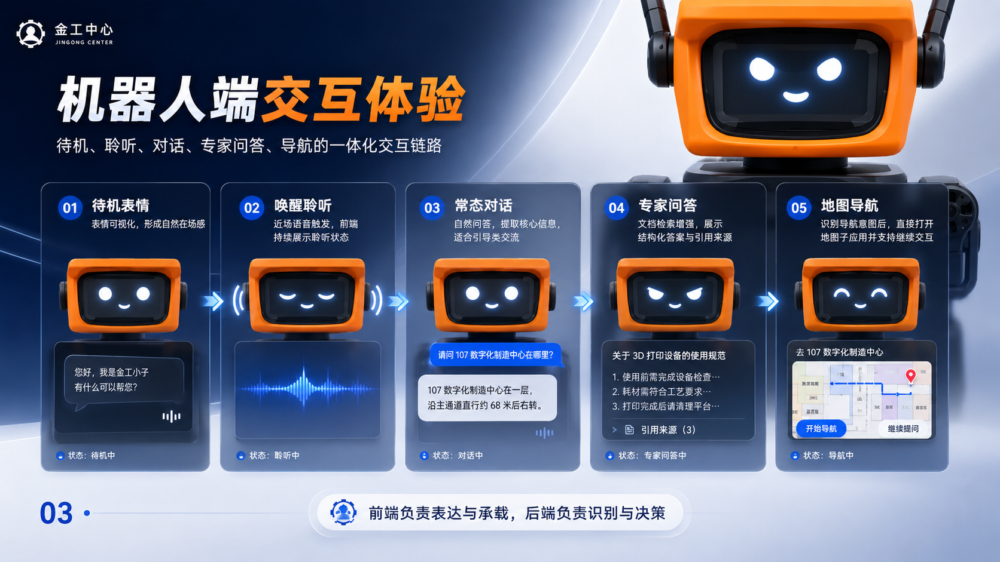
  <br>
  <sub>机器人端状态围绕待机、聆听、常态对话、专家问答和地图导航展开。</sub>
</p>

### 2.3 真实 3D 地图

地图主线从旧版手工 SVG 迁移到真实模型 + 语义拓扑。运行时主模型是 `public/map-models/jingong.glb`，来源为 `models/金工中心模型.3ds`；fallback 是 `public/map-models/jingong-fallback.glb`，来源为 `models/金工中心精确模型.stl`。`models/金工.dwg` 和 `models/金工.skp` 用于平面和空间校准参考。

模型资产记录：

| 资产 | 记录 |
| --- | --- |
| 主 GLB | 263036 bytes，32 nodes，47 meshes，24 materials，5000 vertices，4198 faces |
| fallback GLB | 137384 bytes，2 nodes，1 mesh，3591 vertices，4162 faces |
| 主模型来源 | `models/金工中心模型.3ds` |
| fallback 来源 | `models/金工中心精确模型.stl` |
| 平面校准来源 | `models/金工.dwg`、`models/金工.skp` |

<p align="center">
  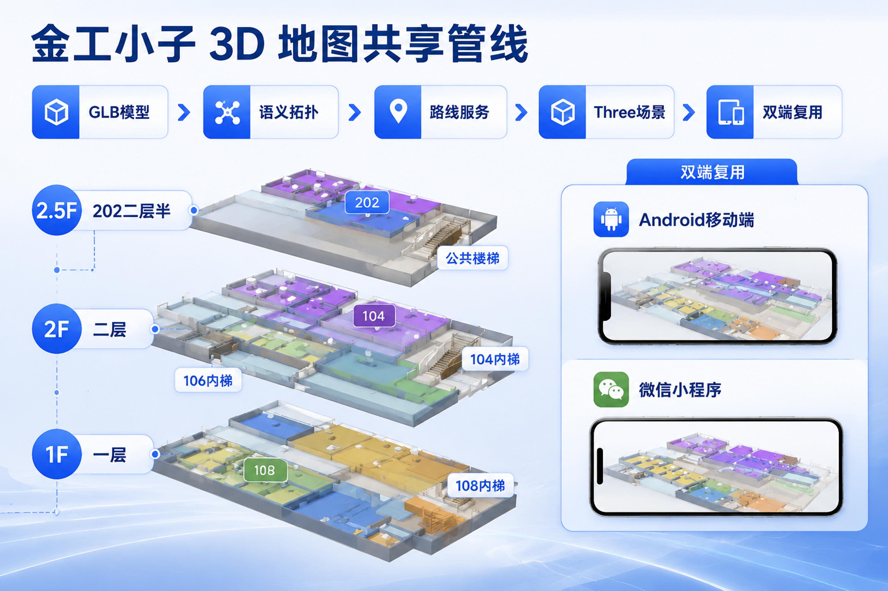
  <br>
  <sub>概念图展示 GLB 模型、语义拓扑、路线服务、Three 场景和双端复用关系；精确事实以源码和校验记录为准。</sub>
</p>

### 2.4 空间语义

地图数据中空间对象不再只用房间矩形表达。`MapData` 包含楼层、房间、服务空间、墙体、门洞、楼梯、中心线、控制点、导航节点和边。

| 对象 | 设计 |
| --- | --- |
| 楼层 | 一层、二层、202 二层半三类展示层；全楼物理对齐，爆炸分层单独拉开 |
| 房间 | 53 个房间保留唯一 ID、房号、功能名、polygon、中心点和门节点 |
| 空间 | 72 个空间区分 room、corridor、stair、restroom、service、storage、reserved |
| 门洞 | 53 个门洞线段，含宽度、法线、连接空间、来源和导航节点 |
| 楼梯 | 4 组楼梯：公共楼梯、104 内梯、106 内梯、108 内梯 |
| 中心线 | 16 条走廊/楼梯接近线，路线沿中心线和门到中心线短连接通行 |
| 校准点 | 16 个控制点，一层 8 个、二层 8 个，覆盖外轮廓、楼梯、门洞和 202 平台 |

来源优先级为 `model > cad > reference > inferred`。模型和 CAD 可确认的门洞优先使用；暂时通过物理常识推断的门洞使用 `source: inferred` 标记，后续用 SKP / DWG 和现场复核替换。

### 2.5 路线与逐段导引

路线服务使用图搜索计算路径。房间中心先连接到门口，门口进入走廊中心线，跨层时进入楼梯口，再从目标门进入房间中心。输出结果包含总距离、预计时间、路线点、逐段步骤和播报文案。


关键约束：

| 路线 | 约束 |
| --- | --- |
| `101 -> 104-2F01` | 必须经过 104 内部楼梯 |
| `101 -> 108-2F04` | 必须经过 108 内部楼梯 |
| `108-lobby -> 202-5` | 必须经过公共楼梯和 202 二层半平台 |
| 公共楼梯 | 只连接公共二层走廊，不能直达 104 / 106 / 108 独立二层 |

逐段导引面向真实行走：用户到达门口、转折点、楼梯口或目标点后可手动推进下一段。地图高亮当前点、下一检查点和终点，路线段按走廊、门段、楼梯和房间进入段区分颜色与高度。

<p align="center">
  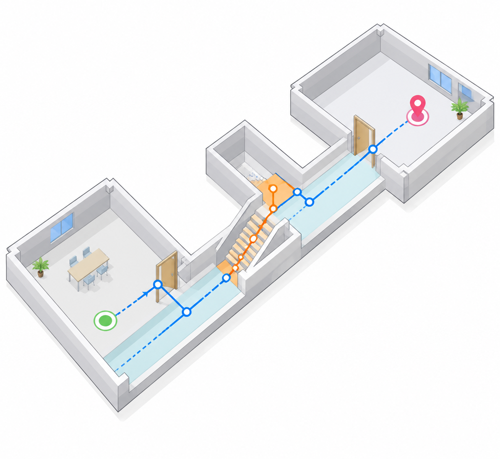
  <br>
  <sub>导航原理图抽象表达房间中心、门洞、走廊中心线、楼梯口和目标中心的逐段关系。</sub>
</p>

### 2.6 移动端交互

横屏移动端按嵌入式触控逻辑设计：

- 待机页隐藏复杂导航，只保留表情、地图 FAB 和低干扰抽屉入口。
- 地图页右侧固定触控栏，包含返回、路线、图层、视角、复位和调试入口。
- 路线、图层、视角面板可关闭、可收起，不允许出现半截卡片和不可关闭浮窗。
- 触控支持旋转、缩放、平移、复位、总览、近看、路线聚焦和单层/分层切换。
- 标签采用动态密度策略，远景只显示关键房间，近景展开完整标签。
- 方向提示以真北为基准，传感器不可用时给出明确反馈。

<p align="center">
  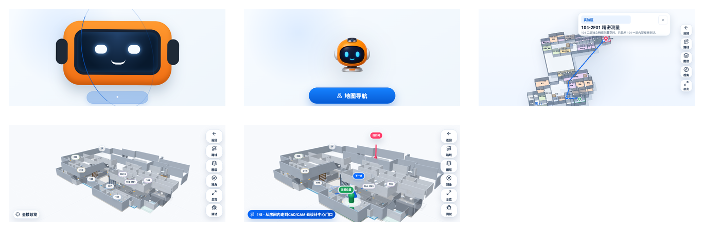
  <br>
  <sub>Android 触控端从待机入口、地图首屏、路线面板到最终 3D 地图逐步收敛。</sub>
</p>

### 2.7 后端智能耦合

后端链路承担麦克风、唤醒过滤、ASR、意图识别、检索/LLM、TTS 和扬声器输出。前端接收 `BackendDirective`，并通过 `MapDirectRequest` 预填地图状态。

```ts
type MapDirectRequest = {
  startRoomId?: string
  targetRoomId?: string
  announce?: Array<"summary" | "distance" | "direction" | "floorChange">
}
```

接入原则：

| 后端任务 | 前端表现 |
| --- | --- |
| 近场唤醒 | 待机页进入唤醒/聆听反馈 |
| 语音识别中 | 显示聆听状态，不显示输入框 |
| 意图理解中 | 显示 processing 状态 |
| 普通问答 | 进入对话页，展示回答和关键词 |
| 专家检索 | 进入专家页，展示答案、关键词和引用卡片 |
| 地图导航 | 进入地图页，预填起终点和播报项 |

<p align="center">
  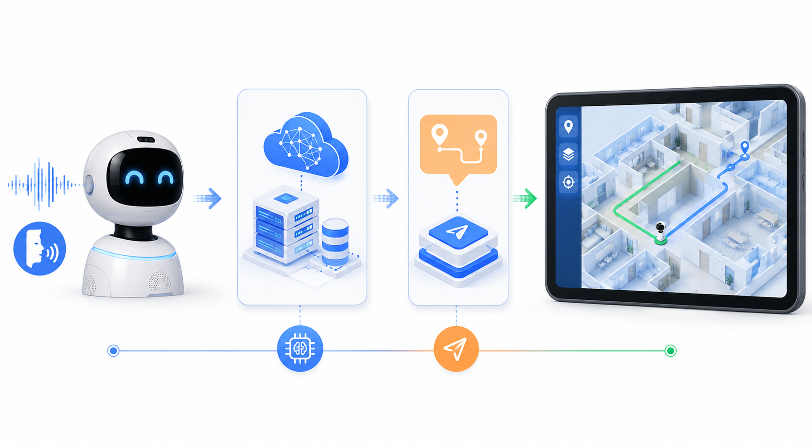
  <br>
  <sub>声控输入、后端智能、地图指令和触控导航形成完整交互链路。</sub>
</p>

### 2.8 小程序路线

小程序目标是和 Android / H5 主线共享地图语义、路线规则、图层含义和 Three 场景。早期 WebView、localhost、截图贴图和自绘多边形路线都不能作为发布目标。当前迁移记录明确要求发布级小程序使用微信 `canvas type="webgl"`、包内模型资源和 Three 适配层，不依赖 `5173` 或全图 PNG。

小程序状态按工程事实处理：

| 项 | 状态 |
| --- | --- |
| 数据同步 | 已有 `generate-miniprogram-map-data.mjs` 同步地图数据 |
| 运行时目标 | `three-platformize` + 微信 WebGL canvas |
| 发布门禁 | `check:miniprogram:parity`、`check:miniprogram:release` |
| 当前结论 | 持续收敛到移动端一致，不能把旧自绘/截图路线作为最终发布形态 |

## 3. 验证过程中发现的问题与迭代

### 3.1 参考图到手工地图

最初参考图强调分层楼体、路线卡、图层筛选、房间详情和比例尺。早期实现先用手工几何建立房间、楼层、路线和面板。验证后暴露出三个问题：

| 问题 | 影响 | 迭代 |
| --- | --- | --- |
| 矩形拼块感明显 | 房间、走廊和空白区域难区分 | 增加空间分类、墙体、走廊面和功能区颜色 |
| 楼层表达单一 | 一层、二层、二层半在视觉上混在一起 | 增加全楼、单层、202 平台、爆炸分层和剖切路线 |
| 路线过于抽象 | 用户不知道下一步该去门口、走廊还是楼梯口 | 改成节点级逐段导引 |

<p align="center">
  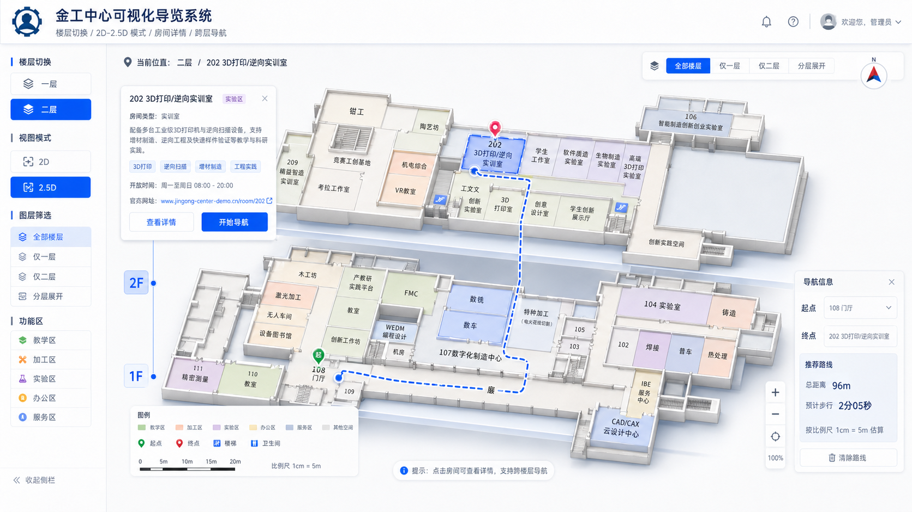
  <br>
  <sub>早期参考图提供了分层、路线面板、房间卡片和图层筛选的方向。</sub>
</p>

### 3.2 移动端首屏和面板

早期移动端沿用了偏桌面端的导航栏和浮层，横屏机器人端出现入口拥挤、浮窗遮挡、面板露半截、右侧操作不明确等问题。迭代后改成内容优先：

- 待机页只显示机器人表情和低干扰地图入口。
- 对话和专家页突出回复内容，不显示屏幕输入口。
- 地图右侧触控栏固定在安全区内。
- 路线、图层、视角、房间详情采用独立面板，全部可关闭。
- 长列表改成分页、分组和常用快捷入口。

<p align="center">
  
  <br>
  <sub>待机页作为机器人脸部展示界面，避免被导航文字和调试入口打断。</sub>
</p>

### 3.3 模型接入和几何校准

真实模型引入后，地图不再只依赖手工 polygon。转换链路将 3DS / STL 进入 GLB 运行时，DWG / SKP 和标识 PDF 用于校准房间名称、门洞和楼梯关系。

发现的问题集中在模型和语义地图对齐：

| 问题 | 根因 | 修复 |
| --- | --- | --- |
| 模型和语义几何错位 | 模型按 bbox 自动居中缩放，语义层使用手写缩放 | 增加 `modelAlignment.ts` 和控制点报告 |
| 门洞和墙体不一致 | 旧路线使用最近 connector 推断门 | 门洞升级为线段，墙体按门洞拆段 |
| 空白空间含义不明 | 未命名区域既像地板又像走廊 | 增加 restroom、service、storage、reserved、void 分类 |
| 二层半悬空 | 202 平台只作为高层，没有下方承托 | 增加 202 平台高度和二层承托表达 |

<p align="center">
  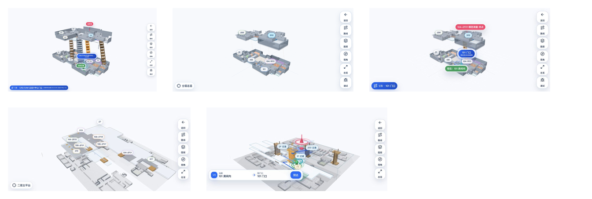
  <br>
  <sub>几何迭代围绕楼梯实体、202 平台、端点标注、分层关系和路线聚焦展开。</sub>
</p>

### 3.4 楼梯和跨层

楼梯问题反复出现，核心是视觉、拓扑和操作三者需要一致。最终数据中保留 4 组楼梯：

| 楼梯 | 接入关系 |
| --- | --- |
| 公共楼梯 | 一层公共走廊到二层公共走廊 |
| 104 内部楼梯 | 104 一层内部到 104-2F01 |
| 106 内部楼梯 | 106 一层到 106-2F |
| 108 内部楼梯 | 108 门厅区域到 108 独立二层房间 |

Three 场景中楼梯不再只用符号表达，而是有下口、上口、梯段、踏步、扶手和上下口配对标记。路线经过楼梯时，楼梯段使用独立颜色，当前点和下一点优先显示。

### 3.5 202 二层半

202 区域在真实空间中属于独立高度平台。早期把它直接归到二层，导致单层视图里空框、平台悬空和上下层难分辨。后续增加 `raised202Space`：

| 字段 | 作用 |
| --- | --- |
| `height: 0.46` | 202 平台相对普通二层的视觉抬升 |
| `platformPolygon` | 202 二层半平台边界 |
| `corridorPolygon` | 202 内部过道 |
| `center` | 平台中心和相机聚焦点 |
| `isRaised202RoomId` | 将 202 系列房间识别为二层半对象 |

二层视图保留下方承托结构，202 平台视图突出高平台、公共楼梯和内部过道，爆炸分层只影响展示，不改变路线拓扑。

### 3.6 标签密度和路线可读性

早期标签在远景和近景完全一致，导致满屏重叠。迭代后使用三档标签密度：

| 视角 | 策略 |
| --- | --- |
| 远景 | 只显示 101、104、106、107、108、202-5、208、210 等关键点 |
| 中景 | 增加走廊、楼梯和目标附近房间 |
| 近景 / 单层 | 展开更多房号、门洞和服务空间角注 |

路线标注也从“每条边写 A -> B”改成“当前段 + 下一检查点 + 终点 pin”。边标签不再遮挡主路线，逐段面板承担详细文字说明。

### 3.7 小程序一致性

小程序路线经历了多个试验：

| 路线 | 结论 |
| --- | --- |
| WebView + `5173` | 开发调试方便，发布不可用 |
| 全图 PNG / 截图贴图 | 视觉接近但交互和真实性失败 |
| 自绘 WebGL 多边形 | 数据可复用，视觉与 Three 主线差异大 |
| 微信 WebGL + Three 适配 | 发布目标，和移动端共享场景 |

<p align="center">
  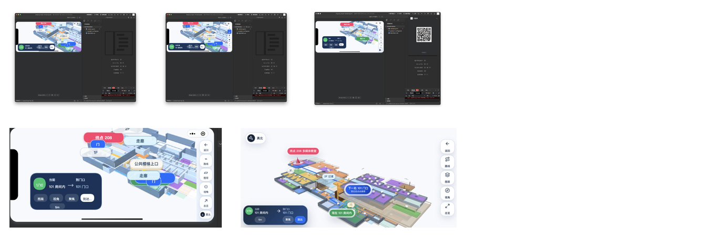
  <br>
  <sub>小程序侧的验证记录覆盖宿主 UI、WebGL 区域、标签、路线、右侧触控栏和 H5 golden 对照。</sub>
</p>

## 4. 验证效果

### 4.1 当前能力

移动端主线已经形成完整闭环：

| 能力 | 状态 |
| --- | --- |
| 待机展示 | 纯表情横屏展示，地图入口低干扰 |
| 聆听反馈 | 支持 wake、listening、processing 三阶段 |
| 常态对话 | 支持答案、关键词和音频状态展示 |
| 专家问答 | 支持答案、关键词、引用卡片和音频状态展示 |
| 地图导航 | 支持真实 3D 模型、语义几何、路线、图层、视角和逐段引导 |
| 后端接入 | 支持 `window.jingongApplyDirective` 和 `jingong:directive` |
| 小程序 | 发布级 Three 一致性路线已明确，旧自绘路线只保留为过渡证据 |

<p align="center">
  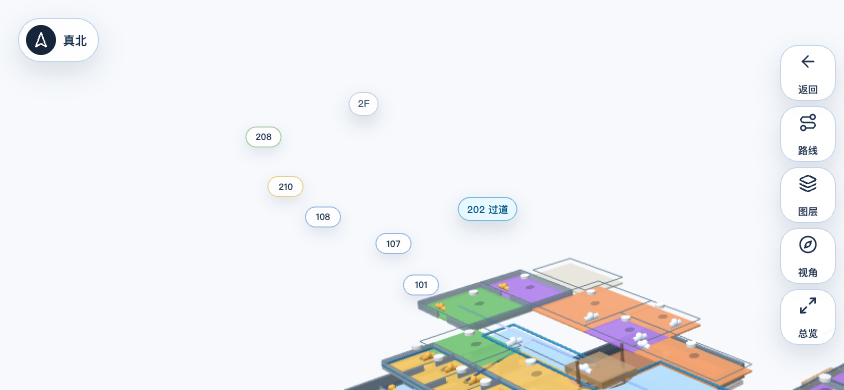
  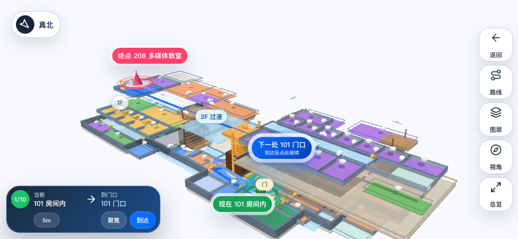
  <br>
  <sub>H5 横屏截图用于快速验证地图首屏、路线、真北、右侧触控栏和逐段导引。</sub>
</p>

### 4.2 数据与模型校验

`npm run check:map` 组合执行地图数据、路线、模型资产、对齐和 QA 报告检查。最新 QA 报告记录：

| 指标 | 数值 |
| --- | --- |
| 房间 | 53 |
| 空间 | 72 |
| 门洞线段 | 53 |
| 楼梯 | 4 |
| 中心线 | 16 |
| 默认图层 | `allFloors` |
| 楼层高度 | `0.92` |
| 爆炸分层偏移 | 一层 `[0.16, 0.13]`，二层 `[-0.46, -0.38]` |
| 控制点 | 16 个，一层 8 个，二层 8 个 |
| 门洞来源 | inferred 30，reference 15，cad 8 |

`qa/alignment/latest-alignment-report.json` 记录了主模型、fallback 模型、runtime bbox、控制点、门洞来源和空间分类。`qa/android-map-smoke-v36.md` 记录 Android 横屏 smoke：`check:map`、`build`、`cargo check`、Android APK build、签名、安装和冷启动均通过。

### 4.3 Android 构建与截图

Android v36 记录：

| 项 | 结果 |
| --- | --- |
| APK | `jingong-xiaozi-0.1.0-map-height-v36-arm64-test-signed.apk` |
| ABI | `arm64-v8a` only |
| 签名 | `CN=Jingong Xiaozi Test, O=ZJU, C=CN` |
| `npm run check:map` | pass |
| `npm run build` | pass |
| `cd src-tauri && cargo check` | pass |
| Android build | pass |
| `adb install -r` | pass |
| 冷启动 | 4584 ms |

<p align="center">
  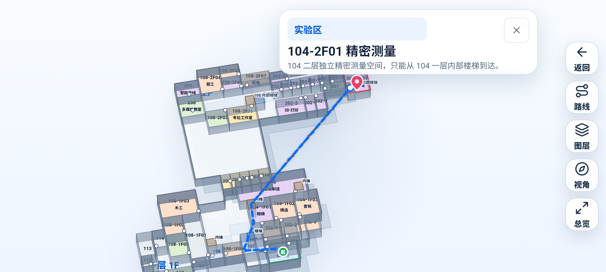
  <br>
  <sub>Android 横屏截图验证地图入口、右侧触控栏、面板、路线和安全区。</sub>
</p>

### 4.4 后端接入验收

后端接入后最小验收集：

| 场景 | 验收点 |
| --- | --- |
| 普通问答 | `wake -> listening -> processing -> chat` 连续展示 |
| 专家检索 | `wake -> listening -> processing -> expert` 展示答案与引用 |
| 地图导航 | `map` 指令打开 `202-5` 路线并允许用户继续操作 |
| 内部楼梯 | `104-2F01` 和 `108-2F04` 不走公共楼梯直达 |
| 静默待机 | 后端不发指令时保持纯表情展示 |

<p align="center">
  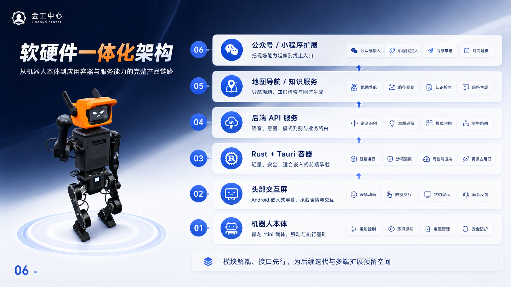
  <br>
  <sub>设计稿中的软件一体化架构对应前端状态机、后端指令、知识问答和地图导航的集成方向。</sub>
</p>

### 4.5 发布状态与风险

移动端主线可作为当前基准版本继续开发。小程序必须继续围绕 Three 共享场景收敛，不能把截图贴图、自绘多边形或本地 WebView 当作发布版本。真实机器人硬件上的传感器方向、麦克风链路、TTS 播放和顶部屏幕亮度还需要在设备集成阶段验证。

| 风险 | 处理 |
| --- | --- |
| 小程序 Three 场景一致性 | 以移动端截图为 golden，完成 `check:miniprogram:parity` |
| 真实硬件方向传感器 | 在机器人端测试权限、校准和无传感器反馈 |
| 模型语义自动识别 | 当前采用模型参照 + 手工语义，后续用 CAD/SKP 增量修正 |
| 首屏加载体积 | 后续按地图场景和普通状态拆包 |
| 后端真实链路 | 按 `BackendDirective` 做最小适配器，逐项接入 ASR / LLM / TTS |

## 附件

| 附件 | 内容 |
| --- | --- |
| [资产证据索引](appendix/assets-index.md) | 参考图、PDF/PPT、QA 截图、模型、APK、小程序和生成图资产 |
| [后端接口约束摘要](appendix/backend-contract-summary.md) | 状态指令、地图参数、音频链路和接入验收 |
| [地图几何与导航校验](appendix/map-geometry-validation.md) | 空间语义、模型校准、门洞、楼梯、202 二层半和路线规则 |
| [发布与验证记录](appendix/release-verification.md) | H5、Android、小程序、构建、签名和剩余风险 |
| [生成图提示词规范](appendix/generated-image-guidelines.md) | 参考图角色、事实锁、禁止项、分辨率实测和弃用规则 |
