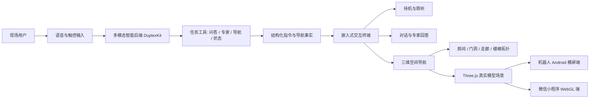
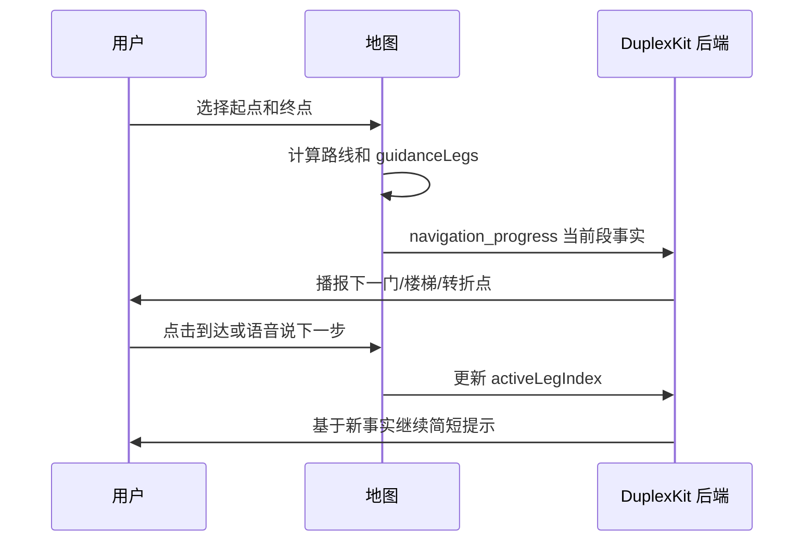
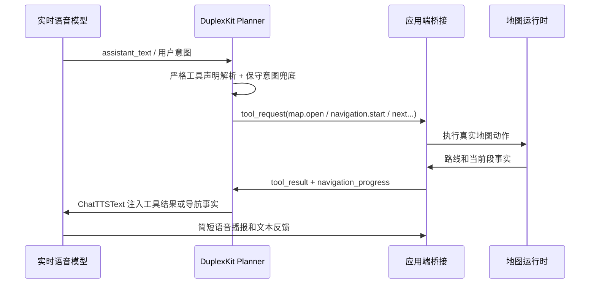

# 金工小子工程训练设计报告

金工小子面向工程训练中心的参观、教学、讲解和空间导引场景。最终形态不是单一网页或单一地图，而是一套安装在青龙机器人顶部横屏上的嵌入式交互终端，并由多模态后端、真实三维地图、微信小程序入口和实体组件共同支撑。

  
   
  早期产品定位稿明确了机器人端展示、地图导航、常态对话、专家模式、Android 端和小程序联动的整体方向。

## 汇报口径

项目最终可按四条工作线说明：

| 工作线 | 说明口径 | 主要成果 |
| --- | --- | --- |
| 总体方案、嵌入式交互终端与跨端集成 | 面向机器人顶部横屏，完成需求拆解、应用状态、触控交互、真实三维导航和微信小程序统一入口 | Android / H5 主线、小程序分包、3D 地图、路线拓扑、发布约束 |
| 实体组件与软硬件协同 | 围绕终端安装、结构适配、现场展示和机器人本体装配展开 | 机器人载体、安装结构、三维打印、装配调试、演示流程 |
| 多模态自然交互 | 让机器人能持续感知、理解用户意图并给出自然反馈 | 唤醒、聆听、语义理解、问答、TTS 播报、打断与状态反馈 |
| 智能后端与任务控制 | 将模型理解结果转为问答、导航、状态切换和设备控制等可执行任务 | DuplexKit 后端、工具声明、导航事实、状态同步、安全中断 |

这四条线不是彼此割裂的模块。移动端应用承担嵌入式交互终端，小程序承担跨端集成入口，后端承担多模态智能与任务编排，实体组件保证这些能力能落到真实机器人上。

## 1. 需求端

本项目的需求不是“做一个能打开的 App”，而是让机器人在真实工程训练中心里承担导览、讲解和任务承接。现场用户不会像使用普通手机应用一样长时间阅读说明，也不会像使用桌面网页一样精确点击小控件；他们更可能站在机器人前，边观察环境边用语音询问，再用触摸确认下一步。因此需求拆解始终围绕三个关键词展开：一眼可懂、逐步可控、跨端一致。

### 1.1 场景需求

工程训练中心的使用对象包括参观访客、上课学生、任课教师、设备管理人员和机器人维护人员。用户并不是坐在电脑前慢慢操作，而是在现场面对机器人，可能边走边问、边看边确认、边听边触摸屏幕。因此系统需要同时满足四类需求：

| 需求 | 具体含义 | 对应表现 |
| --- | --- | --- |
| 状态展示 | 机器人空闲、聆听、理解、回答时要一眼可懂 | 待机页、聆听页、对话页和专家页横屏截图完整 |
| 自然交互 | 用户可以通过语音提出问答或导航需求，触控用于确认、补充和纠错 | 后端指令能驱动 `wake / listening / processing / chat / expert / map` 状态 |
| 空间导引 | 地图必须能解释房间、门、走廊、楼梯、二层半平台和路线节点 | 路线按门口、走廊、楼梯口、平台、目标点逐段展示 |
| 跨端调用 | 微信端可以快速打开同一套地图和导航能力，不能只是截图或临时 H5 | 小程序包内 WebGL、同房间 ID、同路线规则、同发布约束 |

  
   
  课程资料中的青龙 Mini 机器人方向，为顶部嵌入式终端和现场服务机器人提供了工程背景。

### 1.2 初始资料与真实约束

早期输入来自地图参考、空间标识、机器人方案、语音机器人方案和真实 3D 模型。它们对应不同层面的约束：

| 类型 | 代表资产 | 用途 |
| --- | --- | --- |
| 地图参考 | `导航模式图v1.png`、`导航模式图v2.png`、`示意图.jpg` | 2D / 2.5D 地图、路线卡、房间卡、筛选栏、跨层表达 |
| 空间标识 | `金工中心标识20260317-2.pdf` | 一层、二层房间命名、功能区和标识体系 |
| 真实模型 | 3DS、STL、DWG、SKP | 建筑轮廓、墙体、门洞、楼梯、比例校准 |
| 机器人方案 | `金工小子设计稿.pptx` | 机器人端状态、地图导航、专家问答、软件一体化 |
| 智能后端方案 | `设计方案.pdf`、DuplexKit 后端 | 全双工语音、知识增强、任务协同、安全中断、工具协议 |

  
  
   
  标识图提供 101、104、106、107、108、202、208、209、210 等关键空间的命名和功能语义。

真实约束包括：

- 顶部屏幕以横屏展示为主，第一眼必须像机器人终端，而不是桌面管理后台。
- 声控不是唯一入口，用户必须能通过触摸继续、回退、切换视角或修改路线。
- 地图不能穿墙，不能从公共楼梯直接进入 104 / 106 / 108 的独立二层。
- 202-5 属于二层半平台，视觉上要和二层区分，同时下方仍有承托结构。
- 小程序发布版不能依赖 `localhost`、`5173`、公网临时 H5、截图贴图或静态 PNG 地图。
- 后端不能凭房间名猜测距离、时间和下一节点，必须使用应用端回传的导航事实。

这些约束决定了后续技术路线：移动端不能堆满调试面板，小程序不能用静态图片冒充地图，后端不能把大模型回答当成导航事实，三维地图也不能只靠视觉模型本身。系统必须把“看得见的空间”和“算得出的路线”统一起来。

### 1.3 四条线的需求拆解

| 工作线 | 需求重点 |
| --- | --- |
| 嵌入式交互终端 | 低干扰待机、清晰聆听反馈、回答内容优先、地图全屏、右侧触控栏、Material 风格面板 |
| 三维空间导航 | 真实模型参照、空间语义补全、动态标签、楼层切换、路线逐段推进、方向提示 |
| 多模态后端 | 唤醒、ASR、LLM、知识检索、TTS、打断、工具调用、导航事实注入 |
| 微信小程序 | 和移动端共享房间目录、路线规则、3D 场景语义和起终点选择能力 |

### 1.4 设计目标分层

为了避免“每个端各做一套、越做越分叉”，最终目标被拆成四层：

| 层级 | 目标 | 不允许出现的问题 |
| --- | --- | --- |
| 视觉层 | 机器人端、小程序端都能看到统一的金工中心空间表达 | 小程序像截图，移动端像调试页，二者视觉语言完全不同 |
| 交互层 | 语音、触控和路线推进互相补充 | 只能语音或只能触摸，用户到达节点后无法自然继续 |
| 空间层 | 房间、门、走廊、楼梯、平台能被计算 | 路线穿墙、楼梯走错、公共楼梯进入独立二层 |
| 后端层 | 大模型负责理解和表达，空间事实由应用提供 | 后端猜房间、猜距离、猜下一节点，导致幻觉导航 |

这个分层也是设计边界：界面漂亮但路线不可信不算真正可用；后端能聊天但不能调用地图也无法服务现场；小程序能打开但不能独立运行同样只是临时展示。

## 2. 设计方案

### 2.1 总体系统

技术主线采用 Tauri 2、React、TypeScript、Vite 和 Three.js。Android / H5 是嵌入式终端主线，小程序使用微信 WebGL canvas 与 Three 适配层，后端通过 DuplexKit 提供多模态实时链路和工具调用。

总体架构采用“核心语义共享、宿主能力分离”的方式。房间目录、路线拓扑、门洞、楼梯约束和导航进度属于核心语义；Android/Tauri、H5 和微信小程序只是不同宿主。这样做的目的不是追求代码形式统一，而是防止不同端出现不同的地图事实。例如 `104-2F01` 必须走 104 内部楼梯，这条规则不能在移动端成立、小程序端失效，也不能被后端回答绕过。

系统内部按数据流可以拆成四条通道：

| 通道 | 技术实现 | 作用 |
| --- | --- | --- |
| 状态通道 | `BackendDirective`、URL deep-link、React state | 把待机、聆听、回答、专家、地图等状态稳定映射到终端 UI |
| 空间通道 | `mapData.ts`、`routeService.ts`、Three scene | 把房间、走廊、门、楼梯和模型转换成可见、可点、可算路的地图 |
| 语音通道 | WebSocket、PCM binary frame、Realtime model | 让麦克风输入和语音输出在同一实时会话中持续流动 |
| 工具通道 | `tool_request`、`tool_result`、`navigation_progress` | 让后端可以请求地图动作，同时拿到应用端确认过的路线事实 |

```mermaid
flowchart LR
  User[现场用户] --> Voice[语音与触控输入]
  Voice --> Backend[多模态智能后端 DuplexKit]
  Backend --> Tools[任务工具: 问答 / 专家 / 导航 / 状态]
  Tools --> Directive[结构化指令与导航事实]
  Directive --> Terminal[嵌入式交互终端]
  Terminal --> Standby[待机与聆听]
  Terminal --> Response[对话与专家回答]
  Terminal --> Map[三维空间导航]
  Map --> Topology[房间 / 门洞 / 走廊 / 楼梯拓扑]
  Map --> Scene[Three.js 真实模型场景]
  Scene --> Android[机器人 Android 横屏端]
  Scene --> Mini[微信小程序 WebGL 端]
```

核心文件和职责：

| 模块 | 文件 | 职责 |
| --- | --- | --- |
| 应用状态 | `src/shared/appTypes.ts`、`src/App.tsx` | 定义 `standby / chat / expert / map` 和后端指令入口 |
| 后端桥接 | `src/backend-bridge/directives.ts`、`src/duplexkit/useDuplexKitRealtime.ts` | 将后端工具请求、音频状态和导航事实接入前端 |
| 地图主体验 | `src/features/map3d/Map3DApp.tsx` | 3D 场景、模型、图层、相机、路线、标签、面板 |
| 地图语义 | `src/features/map/data/mapData.ts` | 房间、空间、门洞、楼梯、中心线、控制点 |
| 路线服务 | `src/features/map/routeService.ts`、`runtime.ts` | 路线计算、逐段导引、导航进退、标签策略 |
| 小程序宿主 | `miniprogram/` | 首页、响应页、地图分包、WebGL canvas、后端 bridge |
| 后端依赖 | `vendor/DuplexKit` | Realtime 服务、工具规划、房间目录、导航进度事实 |

### 2.2 嵌入式交互终端

应用只有四个主状态：待机、常态对话、专家问答和地图。聆听与理解属于待机页内的过程状态，避免屏幕上出现复杂输入框。这样更像机器人“脸”和“提示屏”，而不是一套桌面软件。

  
   
  最终终端状态：待机、聆听、常态对话和专家问答均围绕横屏机器人使用场景收敛。

设计细节：

- 待机页只保留机器人表情、右下角地图入口和左侧低干扰抽屉。
- 聆听状态用机器人表情、音量波形和简短提示表达，不要求用户读复杂文字。
- 对话和专家页把回答文字放在视觉中心，小机器人降为右下角辅助状态，避免遮挡。
- 后端调试入口保留但默认隐藏，不抢占产品主界面。
- H5 deep-link 支持 `mode=chat / expert / listening / map`，便于后端和 QA 直接验证状态。

交互终端的核心不是“页面数量”，而是状态切换的可信度。用户说话时，屏幕要让人知道机器人正在听；后端理解时，屏幕要让人知道机器人正在处理；回答生成后，屏幕要把主要内容留给文字和语音反馈；进入地图后，屏幕要从“机器人表情”切换为“空间工具”。这些变化都尽量使用少量固定状态完成，避免出现一堆临时按钮和测试面板。

移动端横屏设计还遵守三个触控原则：

| 原则 | 处理方式 |
| --- | --- |
| 内容优先 | 地图、回答、专家答案占据主区域，调试和设置折叠到抽屉或面板 |
| 右手可达 | 地图常用操作集中在右侧，但不做遮挡地图的大按钮墙 |
| 可恢复 | 地图视角提供回正、总览、分层和单层入口，避免用户旋转后找不到方向 |

实现上，`src/App.tsx` 是状态入口，`src/shared/appTypes.ts` 定义可被后端和 H5 deep-link 复用的状态类型。后端并不直接操作页面组件，而是发送结构化 directive；前端收到后再决定进入待机、对话、专家或地图。这样可以保证后端切换页面、调试链接打开页面、小程序入口预填地图时，都走同一套状态机。

回答页和专家页通过 `SpokenAnswer` 和 `AudioChainState` 展示音频状态。`speechStartedAt` 会驱动文本高亮估算，让用户知道当前正在播报的内容；`voiceLabel` 可以显示后端运行时音色配置。这个设计把“听到的声音”和“看到的文字”连起来，避免只显示一段静态回答。

### 2.3 三维空间导航

地图从旧版手工 SVG 迁移为真实模型参照 + 语义拓扑。运行时主模型为 `public/map-models/jingong.glb`，来源于 `models/金工中心模型.3ds`；fallback 为 `jingong-fallback.glb`，来源于 STL。DWG / SKP / 标识 PDF 用于校准空间名称、门洞和楼梯关系。

  
   
  最终地图状态：全楼总览、202 二层半路线、104 内部楼梯路线和 208 公共二层路线均来自同一套三维语义结构。

当前地图语义规模如下：

| 指标 | 当前值 |
| --- | --- |
| 房间 | 53 |
| 门洞线段 | 53 |
| 空间块 | 80 |
| 走廊/楼梯中心线 | 16 |
| 楼梯门户 | 4 |
| 主模型 | 47 meshes / 5000 vertices |
| fallback 模型 | 1 mesh / 3591 vertices |
| 校准控制点 | 16 |
| 对齐误差 | max 0.000 / avg 0.000 |

空间语义不只包含房间，还包含走廊、楼梯、卫生间、服务空间、仓储、预留空间和 202 平台承托结构。每个可见区域都应有意义：要么是房间，要么是走廊，要么是楼梯或服务空间，避免透明空洞和无解释的漂浮构件。

地图采用“双层事实”表达：

| 层 | 作用 |
| --- | --- |
| 真实模型层 | 提供建筑整体比例、墙体观感、门洞、楼梯和空间立体关系 |
| 语义拓扑层 | 提供房间 ID、功能名称、可点击区域、走廊中心线、路线节点和楼梯约束 |

真实模型本身并不知道“202-5 是 3D 打印空间”，也不会自动告诉导航服务“104 独立二层只能走内部楼梯”。因此系统没有把 GLB 当成唯一事实，而是让模型负责空间观感，让 `mapData.ts` 负责可计算语义，再通过校准控制点把两者对齐。这样既能保留真实模型的细节，又能让路线、标签、点击和后端工具稳定工作。

地图显示的几个关键设计如下：

| 设计点 | 目的 |
| --- | --- |
| 闭合空间块 | 每一层边界闭合、内部有填充，避免用户看到无意义空洞 |
| 门洞线段 | 门是空间切换点，路线从房间中心到门、再到走廊，不直接穿墙 |
| 走廊中心线 | 导航沿走廊通行，而不是在房间之间画直线 |
| 楼梯 portal | 公共楼梯和内部楼梯分别建模，保证跨层规则可验证 |
| 动态标签 | 远景少标签，近景展开；单层模式优先显示完整房间信息 |
| 202 二层半 | 平台和下方承托同时存在，防止视觉上像悬空或缺层 |

运行时渲染不是把平面图贴成一张图，而是由 `Map3DApp.tsx` 根据空间数据生成多类几何体：楼板、空间填充、墙体、门槛、楼梯、路线、关键 pin 和标签。渲染顺序固定为“结构先完整、交互后叠加”：先渲染楼层和空间，再渲染墙体与门洞，再叠加路线、当前点、下一节点和终点。普通房间中心点和普通门点默认只作为拾取热区，不直接显示成漂浮点，避免地图变成一堆无意义 marker。

为了让地图“可看、可转、可问、可导航”，地图内部进一步拆成六个可讲清楚的层次：

| 层次 | 处理逻辑 | 用户看到的结果 |
| --- | --- | --- |
| 模型基准 | 3DS / STL 转 GLB 后作为建筑比例和立体外观参照，CAD / SKP / 标识图用于补语义 | 地图不是手绘示意，而是沿真实建筑形态展开 |
| 空间填充 | 每块区域必须归类为房间、走廊、楼梯、卫生间、服务间、仓储、预留或承托结构 | 不出现一大片说不清用途的透明空洞 |
| 墙体门洞 | 墙体从闭合空间边界生成，门只允许出现在两个相邻空间之间 | 门不会支到楼外，路线不会从墙中间穿过去 |
| 楼梯平台 | 楼梯由下口 landing、梯段、踏步、上口 landing 和 portal 组成 | 公共楼梯、104 / 106 / 108 内部楼梯和 202 平台能被区分 |
| 交互热区 | 房间面、门洞和关键节点都有拾取区域，但普通点默认不画出来 | 用户能点房间和路线节点，又不会看到满屏漂浮圆点 |
| 导航覆盖 | 当前段、下一门/楼梯/转折点、终点 pin 后叠加在结构之上 | 导航信息突出，但不破坏建筑本身的可读性 |

走廊和楼梯不是简单换颜色，而是导航逻辑中的“通行骨架”。走廊面负责让用户看懂“这里是公共通行空间”，走廊中心线负责让路线沿真实行走方向推进；楼梯面负责让用户看懂“这里发生跨层”，楼梯 portal 负责让路线知道从哪一层进入、从哪一层出来。这样视觉表达和路线计算是同一套空间关系的两种表现，不会出现看起来像能走、实际路线不能走，或者路线能走、画面上却没有通道的问题。

相机和图层也属于地图技术的一部分：

| 能力 | 实现意义 |
| --- | --- |
| 2.5D 总览 | 默认呈现真实上下对齐关系，适合快速理解全楼 |
| 单层模式 | 过滤非当前楼层，但保留该层完整闭合结构 |
| 202 平台模式 | 强调二层半平台、下方承托和公共楼梯关系 |
| 爆炸分层 | 只改变视觉距离，不改变导航拓扑 |
| 路线聚焦 | 根据当前段弱化无关结构，突出下一节点和终点 |

移动端触控通过 Three 相机控制实现单指旋转、双指缩放、双指平移和视角回正；小程序端则把微信 touch event 映射到同样的相机意图。这里保持的是交互语义一致，而不是每个平台各自写一套地图理解。视角控制分为三类：

| 操作 | 处理方式 | 设计原因 |
| --- | --- | --- |
| 单指拖拽 | 围绕地图中心或当前路线段旋转斜视角 | 现场用户可以像转动实体沙盘一样观察空间 |
| 双指缩放 | 改变相机距离，并联动标签密度 | 远看只看大结构，近看再展开房间名和细节 |
| 双指平移 | 移动画面焦点，但保留回正入口 | 用户可以临时查看局部，不会迷失在地图外 |
| 视角回正 | 回到默认 2.5D 或当前路线推荐视角 | 导航中随时能回到“我应该往哪看”的状态 |

真实导航方向并不简单等于屏幕朝上。系统把地图北向、建筑坐标、当前相机朝向和设备方向分开处理：地图本身保持真实北向基准；相机可以被用户旋转；方向提示根据当前观察平面换算成“在你现在看的地图里应该朝哪边”。如果模拟器或设备没有稳定方向传感器，则明确回退为地图真北，避免假装指南针可用。

标签采用动态密度策略，而不是固定把所有房间号贴在地图上。全楼远景只保留关键区域、目标和当前路线节点；放大或切到单层后，房间名、功能区、卫生间、服务空间等逐步展开；导航时优先显示当前位置、下一节点和终点，低优先级标签自动退让。这样既能保留信息量，又不会在小屏横屏里互相遮挡。

### 2.4 路线与导引

路线设计围绕真实行走，而不是画一条直线。用户最关心的是“现在在哪、下一步到哪个门/楼梯/转折点、终点在哪里”。因此路线输出被拆成逐段导引：

```mermaid
flowchart LR
  A[房间中心] --> B[房间门口]
  B --> C[走廊中心线]
  C --> D[转折点 / 楼梯口]
  D --> E[楼梯上口 / 平台]
  E --> F[目标门口]
  F --> G[目标中心]
```

关键路线约束：

| 路线 | 必须满足 |
| --- | --- |
| `101 -> 104-2F01` | 经过 104 内部楼梯 |
| `101 -> 106-2F` | 经过 106 内部楼梯 |
| `101 -> 108-2F04` | 经过 108 内部楼梯 |
| `108-lobby -> 202-5` | 经过公共楼梯和 202 二层半平台 |
| `101 -> 208` | 经过公共楼梯和二层公共走廊 |

导航进度允许用户手动点“到达”进入下一段，也允许后端通过语音工具调用 `navigation.next` / `navigation.previous` / `navigation.status`。后端播报时只使用应用端回传的当前段事实，不自行估算距离和时间。

逐段导引解决的是现场使用中的“不确定感”。用户站在一个房间门口时，不一定需要一次看完整条路线，反而更需要知道下一个可确认节点在哪里。系统因此把路径拆为“从 A 到 B 的当前段”，并把当前点、下一检查点和终点作为高优先级视觉元素。路线面板只提供当前段说明、下一步、上一步和状态摘要，避免整张地图被长文本遮挡。

每一段导引都按“空间转换”来组织，而不是按抽象折线组织。典型过程是：从房间中心走到门口，穿过门洞进入走廊，沿走廊中心线走到转折点或楼梯口，经过楼梯 portal 到达另一层，再从目标门口进入目标空间。这样路线的每一个节点都能对应现场能看到的东西：门、走廊口、楼梯口、平台或房间入口。

在界面上，导航不会把所有边都标满文字。主地图只强调三类视觉信息：当前位置、下一确认点、终点；路线颜色再区分走廊段、门段、楼梯段和房间进入段。更长的说明放在路线面板里，以“一步一步”的方式出现。用户到达下一确认点后，可以点“到达下一步”，也可以直接说“下一步”；如果走错或想回看，可以点“上一步”或语音回退。这样导引更像现场陪走，而不是给一张复杂路线图让用户自己解读。

地图内交互围绕三个动作设计：

| 动作 | 对应能力 |
| --- | --- |
| 点房间 | 查看名称、功能、所在楼层，可作为起点或终点 |
| 点路线节点 | 聚焦当前门、楼梯或转折点，查看下一步说明 |
| 切图层/视角 | 在全楼、单层、202 平台、爆炸分层和路线聚焦之间切换 |

这些交互都服务于同一个目标：用户始终能回答“我现在看的是哪一层、我要去哪里、下一步走到哪个真实空间节点”。因此地图不会把所有调试点、所有门点和所有中心点都直接暴露出来；它们存在于计算和点击热区里，但产品界面只显示当前场景真正需要的信息。

导航状态还可以反向喂给后端，形成语音和触控的一致进度：

```mermaid
sequenceDiagram
  participant U as 用户
  participant M as 地图
  participant B as DuplexKit 后端
  U->>M: 选择起点和终点
  M->>M: 计算路线和 guidanceLegs
  M->>B: navigation_progress 当前段事实
  B->>U: 播报下一门/楼梯/转折点
  U->>M: 点击到达或语音说下一步
  M->>B: 更新 activeLegIndex
  B->>U: 基于新事实继续简短提示
```

### 2.5 多模态智能后端

后端从“以后再接入”的设想，升级为已锁定的全栈依赖。当前主仓库通过 `docs/backend-duplexkit-version.json` 锁定 DuplexKit：

| 项 | 内容 |
| --- | --- |
| 后端仓库 | `https://github.com/ElysiaFollower/DuplexKit.git` |
| 分支 | `main` |
| 锁定提交 | `167b6a8861666b63c3bdcbf91567ef12fac5e7fd` |
| 提交说明 | `Ground navigation answers in app progress facts` |

后端提供实时语音链路、工具规划、房间目录、导航事实注入和安全边界。这里的“实时语音链路”不是传统的“ASR 先转文字、LLM 再生成、TTS 最后播报”的三级串联，而是原生实时全双工方案：前端持续把麦克风 PCM 音频送入后端，后端桥接实时语音大模型，上游模型在同一会话里完成听、想、说，并持续返回转写文本、模型文本和 PCM 音频。

全双工链路分为前端采集、后端桥接、上游实时会话、前端播放四段：

| 阶段 | 实现 | 说明 |
| --- | --- | --- |
| 前端采集 | `getUserMedia` + `ScriptProcessorNode` | 采集单声道麦克风输入，计算 RMS 音量用于聆听动画 |
| 音频编码 | `downsample` + `floatToInt16Buffer` | 将浏览器采样率下采样到 24 kHz，并转为 Int16 PCM |
| 局域网传输 | `/api/realtime` WebSocket binary frame | 音频帧不包 WAV 头，持续以二进制帧发送 |
| 后端桥接 | `attachVolcRealtimeBridge` / `VolcRealtimeBridge` | 建立到火山实时语音模型的上游 WebSocket，会话启动后转发音频 |
| 模型事件 | ASR / LLM / TTS event | 后端把上游事件转换成 `transcript`、`assistant_text`、`tts_start`、`message_end` 等应用消息 |
| 前端播放 | `PcmFloat32Player` | 接收后端二进制 PCM 输出，按到达顺序排队播放；用户重新说话时清空旧播放 |

全双工的关键价值是“用户不用等机器人完全说完才能继续说”。上游触发 `asr_start` 时，前端会清空正在播放的音频队列，屏幕回到聆听状态；后端也会把新一轮 ASR、LLM、TTS 边界发给前端。这样可以实现自然打断，而不是机械轮流讲话。

后端公开工具包括：

| 工具 | 作用 |
| --- | --- |
| `map.open` / `map.close` | 打开或关闭地图 |
| `map.set_origin` / `map.set_destination` | 设置起点或终点 |
| `navigation.start` | 启动导航 |
| `navigation.next` / `navigation.previous` | 下一段或上一段 |
| `navigation.status` | 查询当前段、下一节点和剩余距离 |

导航相关回答需要基于 `navigation_progress`，其中包括当前节点、下一门/楼梯/转折点、目标、当前段、剩余距离、预计时间和方向状态。这样可以避免“房间认不全”“距离乱猜”“不知道当前走到哪一段”等问题。

  
   
  声控输入、后端智能、结构化工具、地图状态和触控推进共同形成自然导引链路。

后端设计中最重要的不是“能调用大模型”，而是把大模型限制在合适的位置。模型负责理解用户说“我要去 3D 打印那边”对应哪个空间，负责把当前段事实组织成自然语言；但它不负责发明空间关系。房间目录、路线、楼梯权限、当前段和剩余距离都由应用端或后端工具事实提供。

因此后端契约包含三类边界：

| 边界 | 说明 |
| --- | --- |
| 身份边界 | 机器人回答围绕金工小子、工程训练中心和现场服务，不引入无关平台身份 |
| 空间边界 | 房间名、房间 ID、楼梯权限和路线进度来自统一目录和地图事实 |
| 任务边界 | 后端发工具请求，前端执行地图和状态变化；前端不直接接管 ASR/TTS |

这个边界让系统在演示中更稳：用户可以打断、改终点、问当前进度，也可以不用语音，直接在地图里点下一段。语音链路和触控链路不是两套逻辑，而是共享同一个导航进度。

工具注入的内部流程如下：

```mermaid
sequenceDiagram
  participant R as 实时语音模型
  participant B as DuplexKit Planner
  participant A as 应用端桥接
  participant M as 地图运行时
  R->>B: assistant_text / 用户意图
  B->>B: 严格工具声明解析 + 保守意图兜底
  B->>A: tool_request(map.open / navigation.start / next...)
  A->>M: 执行真实地图动作
  M->>A: 路线和当前段事实
  A->>B: tool_result + navigation_progress
  B->>R: ChatTTSText 注入工具结果或导航事实
  R->>A: 简短语音播报和文本反馈
```

其中有两个细节比较重要：

- 工具调用不是直接相信模型的一句话。后端先尝试解析严格工具声明，如果模型没有按声明格式输出，再用保守的用户意图兜底解析，例如“下一步”“还剩多远”“导航到 208”。兜底解析只覆盖明确短语，避免误触发。
- 工具结果会通过 `ChatTTSText` 注入实时会话，让模型知道“地图已打开”“当前段到走廊入口还有多少米”。对于纯工具结果注入，后端默认抑制这段注入产生的前端文本和音频，避免打断正常对话；对于 `navigation_progress` 且需要播报的情况，才转成面向用户的简短提示。

后端还维护了超时和回退机制。`tool_request` 发出后等待应用端 `tool_result`，默认 20 秒超时；如果应用没有返回，则使用后端 fallback 状态给出可解释结果，同时记录 trace。真实导航场景下，应用端会优先返回 client-origin result，保证路线事实来自地图。

### 2.6 微信小程序跨端集成

小程序不是截图版，也不是套一个 `5173` 服务。当前路线是微信原生页面 + 地图分包 + 包内 WebGL/Three 场景 + 同步地图数据。首页保留机器人端一致的入口风格，地图页支持真实起终点选择、路线计算、图层和触控。

小程序发布约束：

| 项 | 当前状态 |
| --- | --- |
| AppID | `wx160ad5f2d6c16281` |
| 页面方向 | 横屏 |
| 地图资源 | 包内分包，不依赖 localhost |
| 地图路线 | 使用同步后的 `map-data` 和 `calculateRoute` 规则 |
| 起终点 | 支持常用路线和任意起终点组合 |
| 后端桥 | 支持 `/api/tools`、`/api/realtime`、`navigation_progress` 和 `tool_result` |
| 发布约束 | 自包含资源、同路线规则、同起终点能力、同后端 bridge |

  
   
  小程序迭代从 WebView、截图贴图、自绘多边形逐步收敛到发布级 WebGL/Three 路线。

小程序的定位是“机器人之外的同一服务入口”。用户不一定站在机器人前，也可能通过公众号或小程序先查路线、确认房间位置，再到现场使用机器人。因此小程序必须能独立打开、独立算路、独立展示地图，同时又不能产生另一套空间解释。

最终采用自包含 WebGL 路线，是因为它满足三点：

| 目标 | 实现 |
| --- | --- |
| 打开即用 | GLB、地图数据、路线数据和运行资源进入小程序包/分包 |
| 能交互 | 保留旋转、缩放、平移、图层、路线和起终点选择 |
| 不分叉 | 通过同步脚本和 parity 检查约束地图数据、房间目录和路线规则 |

被放弃的 WebView 和截图路线并不是技术上不能做，而是无法满足发布场景：WebView 依赖外部服务和业务域名，截图无法表达动态路线和触控，独立自绘又会快速偏离移动端。最终方案更复杂，但它把“小程序像不像移动端”变成了可检查的工程约束。

小程序端的技术重点是“把移动端地图能力搬到微信运行环境”，而不是重写一个低保真页面。分包内保存模型、地图数据和运行时资源；页面通过 `canvas type="webgl"` 初始化 Three 适配层，再把触摸事件转为相机控制。路线、标签、图层和起终点选择都引用同步后的地图数据，发布检查会阻止重新引入 `web-view`、`localhost`、全图 PNG 贴图和固定 demo 路线。

小程序与后端的衔接也不走本地 `5173`。地图页可以通过 query 或页面状态得到 `MapDirectRequest`，也可以通过小程序 bridge 与 DuplexKit 服务交换工具请求和 `navigation_progress`。这保证小程序不是移动端的截图壳，而是机器人服务在微信端的独立入口。

### 2.7 实体组件与软硬件协同

实体侧围绕“让数字能力落在机器人上”展开：顶部终端需要适配机器人结构，屏幕角度、安装空间、供电、线缆、散热和现场展示流程都会影响交互效果。软件设计因此保持横屏、低干扰、大触控目标和少层级入口，便于装配后直接演示。

软件也为实体集成预留了接口：后端连接页可以配置局域网 Mac IP 和端口；方向提示支持“有传感器时显示校准方向、无传感器时按地图真北显示”；导航推进支持人工点击和语音推进，后续接入机器人定位后可以把“到达下一节点”从手动确认升级为自动确认。这样当前版本既能在课程展示中稳定运行，也不会堵死真机传感器和机器人动作控制的后续接入。

  
   
  设计稿中的服务延伸方向对应机器人载体、现场展示、交互终端和后续场景扩展。

## 3. 验证过程中发现的问题与迭代

验证不是最后补一遍命令，而是贯穿整个项目的设计方法。很多最终方案都来自反复发现问题：地图看着乱、楼层分不清、小程序像假地图、后端说不清当前段、界面像调试后台。每次迭代都尽量把问题收敛成可复核的设计约束，而不是只靠肉眼判断。

### 3.1 交互终端迭代

早期界面更像桌面端：入口多、浮层重、面板连续滚动、右侧操作不够明确。横屏验证后暴露出这些问题：

| 问题 | 影响 | 迭代结果 |
| --- | --- | --- |
| 待机页信息过多 | 机器人“脸”的感觉被破坏 | 改成纯表情 + 地图 FAB + 抽屉 |
| 浮窗不可关闭或露半截 | 触控端不适合连续滚动 | 面板改为 Material 风格，可关闭、可分页 |
| 对话/专家页机器人遮挡文字 | 回答内容不够清楚 | 机器人移到右下角，回答文字居中优先 |
| URL 只能直达地图 | QA 和后端无法直接验证 chat/expert/listening | 增加 `mode=chat/expert/listening` deep-link |

### 3.2 地图几何迭代

地图问题是整个项目迭代最多的部分。早期先做手工平层地图，随后引入真实 3D 模型、门洞、走廊、楼梯和 202 平台。反复验证后，明确了一个原则：地图不能只是“看起来像楼”，而要成为可计算、可解释、可导航的空间结构。

| 问题 | 根因 | 处理 |
| --- | --- | --- |
| 房间和走廊不清 | 只画房间，没有对未命名空间分类 | 增加 corridor、restroom、service、storage、reserved、support |
| 墙体、门点、房间点漂浮 | marker 和墙体高度散落在渲染逻辑里 | 集中 render policy，普通门点隐藏为热区，关键点才显示 pin |
| 楼梯像碎片 | 楼梯视觉和上下 landing 没有统一 | 重建 landing、梯段、踏步、扶手和上下口配对 |
| 二层与二层半混乱 | 202 平台既不是普通二层，也不能悬空 | 增加二层半平台和下方承托结构 |
| 总览、单层、分层不一致 | 不同视图各画各的 | 统一闭合空间模型，视图只是同一结构的不同表达 |

  
   
  几何迭代围绕墙体闭合、走廊填充、楼梯实体、202 平台、端点标注和分层视图展开。

最终的改法不是简单删掉墙体、降低透明度或换颜色，而是回到空间结构本身：先确定每一层外轮廓闭合，再把内部区域分类，再从相邻空间生成门，再由门和走廊中心线生成路线。这样总览、单层和分层看到的是同一个结构的不同表达，而不是三套互相矛盾的画法。

### 3.3 导航与语音协同迭代

路线最初只负责从起点到终点，后来发现现场用户更需要“下一步应该走到哪里”。因此导航从整体路线升级为节点级导引：

- 当前点、下一门/楼梯/转折点、终点 pin 高优先级显示。
- 边标签不再铺满地图，详细说明放到路线面板。
- 用户到达一个节点后可以手动点击“到达”，也可以通过语音说“下一步”。
- 后端只能播报前端回传的当前段事实，避免自行编造剩余距离或时间。
- 模拟器没有方向传感器时，界面明确提示地图按真北显示。

### 3.4 后端接入迭代

后端接入后，设计文档需要从“前端接收指令”升级到“前后端协同闭环”。验证中重点发现并处理了四类问题：

| 问题 | 处理 |
| --- | --- |
| 智能体容易提到无关模型或平台 | 后端提示词强化身份和场景边界，回答围绕金工小子和工程训练中心 |
| 房间号识别不全 | DuplexKit 房间目录与前端 53 个房间做一致性校验 |
| 导航过程缺少当前段认知 | 增加 `navigation_progress`，后端播报当前段、下一节点、剩余距离 |
| 工具声明可能漂移 | `check:fullstack:contracts` 校验工具、远端、锁定提交和脚本 |

后端接入后，文档也同步改变：早期只需要说明前端有哪些页面，现在必须说明后端什么时候能发指令、哪些事实由谁负责、工具名如何保持稳定、导航进度如何回传。这样后端同学接入时不会把地图当作普通页面跳转，也不会把路线问答当成自由生成文本。

### 3.5 小程序迭代

小程序经历了几条被验证后放弃的路线：

| 尝试 | 放弃原因 |
| --- | --- |
| WebView 打开 H5 | 依赖外部服务和域名，不是打开即用 |
| 静态 PNG / 截图贴图 | 看起来像地图，但不能旋转、缩放、选择和真实寻路 |
| 小程序自绘简化地图 | 功能和移动端差异大，容易回退到旧地图 |
| 包内 WebGL + Three 适配 | 当前发布目标，能复用地图语义和路线规则 |

小程序最终不是只保证页面能打开，而是从设计上禁止 WebView、localhost、全图 PNG 贴图和固定 demo 路线，保留起终点组合、后端 bridge、正式 AppID 和地图分包配置。

### 3.6 主文档表达迭代

项目后期遇到的一个问题是“代码已经做了很多，但材料看起来仍然单薄”。因此主文档不再只列功能，也不把关键内容分散到很多小文档里，而是把每条线的需求、设计方案、验证问题和最终效果都收束到同一份报告中：

| 部分 | 主文档中的表达重点 |
| --- | --- |
| 总体方案 | 说明为什么要做机器人顶部横屏终端，而不是普通网页或后台 |
| 地图导航 | 直接讲清楚模型来源、空间语义、触控视角、楼梯走廊、动态标签和逐段导引 |
| 多模态后端 | 直接讲清楚实时全双工语音链路、工具注入、导航事实回传和打断机制 |
| 微信小程序 | 说明为什么必须自包含 WebGL，而不是 WebView、localhost 或截图 |
| 实体协同 | 说明软件如何服务机器人安装、现场展示和后续真机定位接入 |

最终汇报时，可以把“金工小子”概括为一个真实场景导引系统：机器人端负责现场状态和触控确认，三维地图负责空间理解和路线推进，多模态后端负责自然语言和任务调度，小程序负责离开机器人后的移动入口。四者共享同一套房间、门洞、走廊、楼梯和导航进度事实，因此不会变成几个互相割裂的 demo。
