# 金工小子工程训练设计报告

金工小子面向工程训练中心的参观、教学、讲解和空间导引场景。最终形态不是单一网页或单一地图，而是一套安装在青龙机器人顶部横屏上的嵌入式交互终端，并由多模态后端、真实三维地图、微信小程序入口和实体组件共同支撑。

<p align="center">
  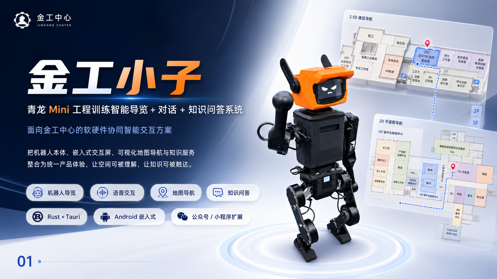
  <br>
  <sub>早期产品定位稿明确了机器人端展示、地图导航、常态对话、专家模式、Android 端和小程序联动的整体方向。</sub>
</p>

## 汇报口径

项目最终可按四条工作线说明：

| 工作线 | 说明口径 | 主要成果 |
| --- | --- | --- |
| 总体方案、嵌入式交互终端与跨端集成 | 面向机器人顶部横屏，完成需求拆解、应用状态、触控交互、真实三维导航和微信小程序统一入口 | Android / H5 主线、小程序分包、3D 地图、路线拓扑、发布门禁 |
| 实体组件与软硬件协同 | 围绕终端安装、结构适配、现场展示和机器人本体装配展开 | 机器人载体、安装结构、三维打印、装配调试、演示流程 |
| 多模态自然交互 | 让机器人能持续感知、理解用户意图并给出自然反馈 | 唤醒、聆听、语义理解、问答、TTS 播报、打断与状态反馈 |
| 智能后端与任务控制 | 将模型理解结果转为问答、导航、状态切换和设备控制等可执行任务 | DuplexKit 后端、工具声明、导航事实、状态同步、安全中断 |

这四条线不是彼此割裂的模块。移动端应用承担嵌入式交互终端，小程序承担跨端集成入口，后端承担多模态智能与任务编排，实体组件保证这些能力能落到真实机器人上。

## 1. 需求端

### 1.1 场景需求

工程训练中心的使用对象包括参观访客、上课学生、任课教师、设备管理人员和机器人维护人员。用户并不是坐在电脑前慢慢操作，而是在现场面对机器人，可能边走边问、边看边确认、边听边触摸屏幕。因此系统需要同时满足四类需求：

| 需求 | 具体含义 | 验收方式 |
| --- | --- | --- |
| 状态展示 | 机器人空闲、聆听、理解、回答时要一眼可懂 | 待机页、聆听页、对话页和专家页横屏截图完整 |
| 自然交互 | 用户可以通过语音提出问答或导航需求，触控用于确认、补充和纠错 | 后端指令能驱动 `wake / listening / processing / chat / expert / map` 状态 |
| 空间导引 | 地图必须能解释房间、门、走廊、楼梯、二层半平台和路线节点 | 路线按门口、走廊、楼梯口、平台、目标点逐段展示 |
| 跨端调用 | 微信端可以快速打开同一套地图和导航能力，不能只是截图或临时 H5 | 小程序包内 WebGL、同房间 ID、同路线规则、同发布门禁 |

<p align="center">
  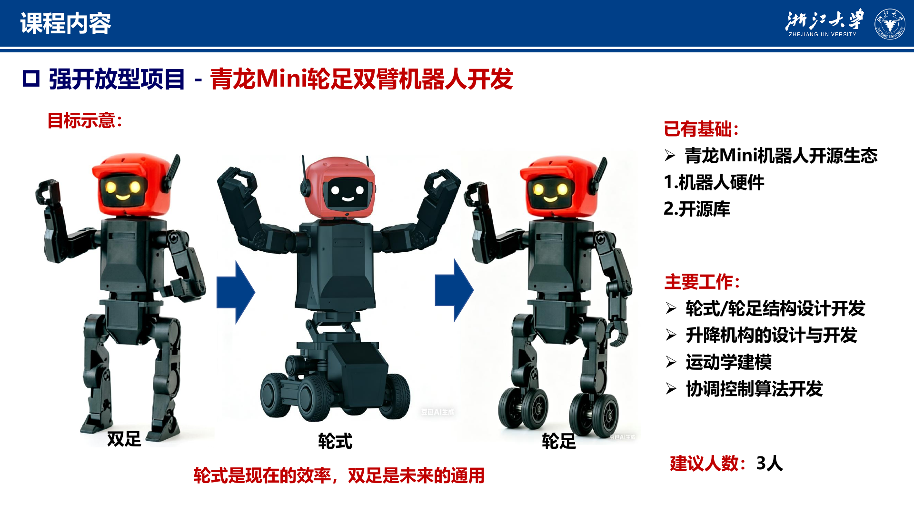
  <br>
  <sub>课程资料中的青龙 Mini 机器人方向，为顶部嵌入式终端和现场服务机器人提供了工程背景。</sub>
</p>

### 1.2 初始资料与真实约束

早期输入来自地图参考、空间标识、机器人方案、语音机器人方案和真实 3D 模型。它们对应不同层面的约束：

| 类型 | 代表资产 | 用途 |
| --- | --- | --- |
| 地图参考 | `导航模式图v1.png`、`导航模式图v2.png`、`示意图.jpg` | 2D / 2.5D 地图、路线卡、房间卡、筛选栏、跨层表达 |
| 空间标识 | `金工中心标识20260317-2.pdf` | 一层、二层房间命名、功能区和标识体系 |
| 真实模型 | 3DS、STL、DWG、SKP | 建筑轮廓、墙体、门洞、楼梯、比例校准 |
| 机器人方案 | `金工小子设计稿.pptx` | 机器人端状态、地图导航、专家问答、软件一体化 |
| 智能后端方案 | `设计方案.pdf`、DuplexKit 后端 | 全双工语音、知识增强、任务协同、安全中断、工具协议 |

<p align="center">
  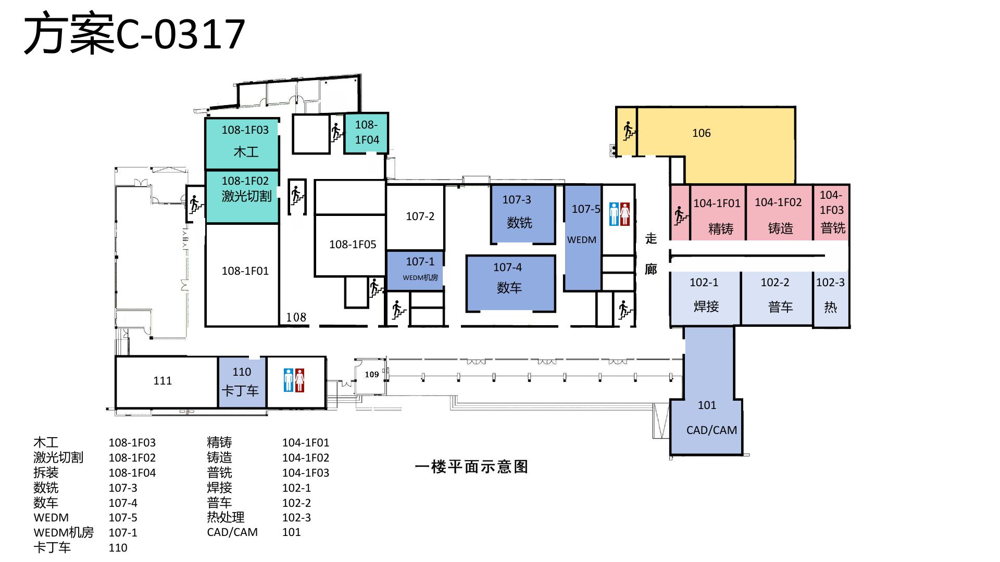
  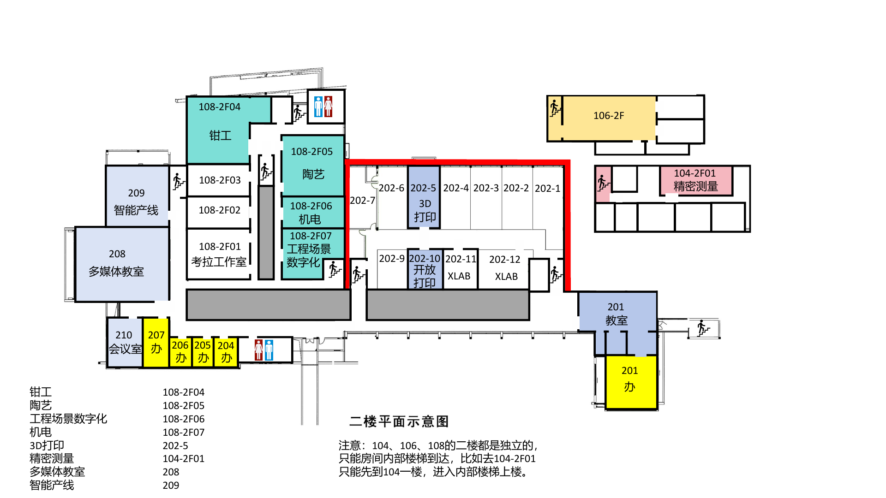
  <br>
  <sub>标识图提供 101、104、106、107、108、202、208、209、210 等关键空间的命名和功能语义。</sub>
</p>

真实约束包括：

- 顶部屏幕以横屏展示为主，第一眼必须像机器人终端，而不是桌面管理后台。
- 声控不是唯一入口，用户必须能通过触摸继续、回退、切换视角或修改路线。
- 地图不能穿墙，不能从公共楼梯直接进入 104 / 106 / 108 的独立二层。
- 202-5 属于二层半平台，视觉上要和二层区分，同时下方仍有承托结构。
- 小程序发布版不能依赖 `localhost`、`5173`、公网临时 H5、截图贴图或静态 PNG 地图。
- 后端不能凭房间名猜测距离、时间和下一节点，必须使用应用端回传的导航事实。

### 1.3 四条线的需求拆解

| 工作线 | 需求重点 |
| --- | --- |
| 嵌入式交互终端 | 低干扰待机、清晰聆听反馈、回答内容优先、地图全屏、右侧触控栏、Material 风格面板 |
| 三维空间导航 | 真实模型参照、空间语义补全、动态标签、楼层切换、路线逐段推进、方向提示 |
| 多模态后端 | 唤醒、ASR、LLM、知识检索、TTS、打断、工具调用、导航事实注入 |
| 微信小程序 | 和移动端共享房间目录、路线规则、3D 场景语义和起终点选择能力 |

## 2. 设计方案

### 2.1 总体系统

技术主线采用 Tauri 2、React、TypeScript、Vite 和 Three.js。Android / H5 是嵌入式终端主线，小程序使用微信 WebGL canvas 与 Three 适配层，后端通过 DuplexKit 提供多模态实时链路和工具调用。

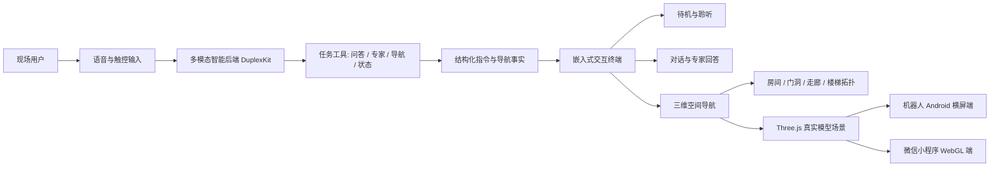
```mermaid
flowchart LR
  User[现场用户] --> Voice[语音与触控输入]
  Voice --> Backend[多模态智能后端 DuplexKit]
  Backend --> Tools[任务工具: 问答 / 专家 / 导航 / 状态]
  Tools --> Directive[结构化指令与导航事实]
  Directive --> Terminal[嵌入式交互终端]
  Terminal --> Standby[待机与聆听]
  Terminal --> Response[对话与专家回答]
  Terminal --> Map[三维空间导航]
  Map --> Topology[房间 / 门洞 / 走廊 / 楼梯拓扑]
  Map --> Scene[Three.js 真实模型场景]
  Scene --> Android[机器人 Android 横屏端]
  Scene --> Mini[微信小程序 WebGL 端]
```

核心文件和职责：

| 模块 | 文件 | 职责 |
| --- | --- | --- |
| 应用状态 | `src/shared/appTypes.ts`、`src/App.tsx` | 定义 `standby / chat / expert / map` 和后端指令入口 |
| 后端桥接 | `src/backend-bridge/directives.ts`、`src/duplexkit/useDuplexKitRealtime.ts` | 将后端工具请求、音频状态和导航事实接入前端 |
| 地图主体验 | `src/features/map3d/Map3DApp.tsx` | 3D 场景、模型、图层、相机、路线、标签、面板 |
| 地图语义 | `src/features/map/data/mapData.ts` | 房间、空间、门洞、楼梯、中心线、控制点 |
| 路线服务 | `src/features/map/routeService.ts`、`runtime.ts` | 路线计算、逐段导引、导航进退、标签策略 |
| 小程序宿主 | `miniprogram/` | 首页、响应页、地图分包、WebGL canvas、后端 bridge |
| 后端依赖 | `vendor/DuplexKit` | Realtime 服务、工具规划、房间目录、导航进度事实 |

### 2.2 嵌入式交互终端

应用只有四个主状态：待机、常态对话、专家问答和地图。聆听与理解属于待机页内的过程状态，避免屏幕上出现复杂输入框。这样更像机器人“脸”和“提示屏”，而不是一套桌面软件。

<p align="center">
  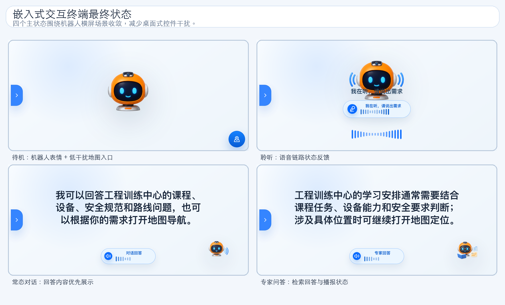
  <br>
  <sub>最终终端状态：待机、聆听、常态对话和专家问答均围绕横屏机器人使用场景收敛。</sub>
</p>

设计细节：

- 待机页只保留机器人表情、右下角地图入口和左侧低干扰抽屉。
- 聆听状态用机器人表情、音量波形和简短提示表达，不要求用户读复杂文字。
- 对话和专家页把回答文字放在视觉中心，小机器人降为右下角辅助状态，避免遮挡。
- 后端调试入口保留但默认隐藏，不抢占产品主界面。
- H5 deep-link 支持 `mode=chat / expert / listening / map`，便于后端和 QA 直接验证状态。

### 2.3 三维空间导航

地图从旧版手工 SVG 迁移为真实模型参照 + 语义拓扑。运行时主模型为 `public/map-models/jingong.glb`，来源于 `models/金工中心模型.3ds`；fallback 为 `jingong-fallback.glb`，来源于 STL。DWG / SKP / 标识 PDF 用于校准空间名称、门洞和楼梯关系。

<p align="center">
  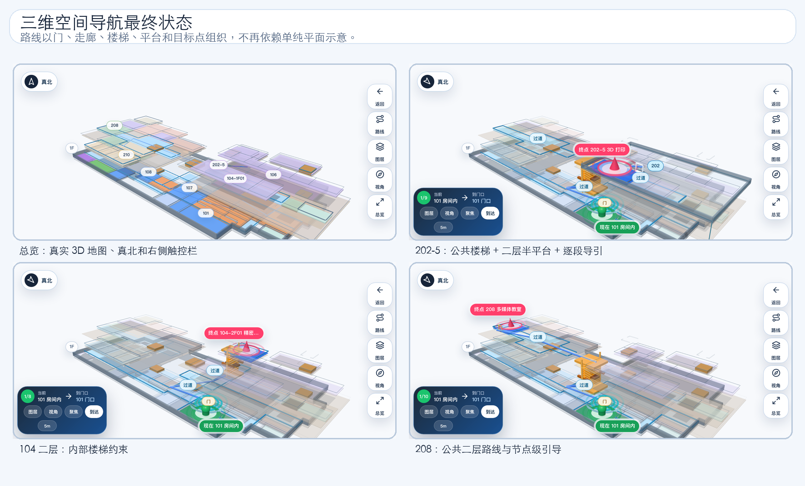
  <br>
  <sub>最终地图状态：全楼总览、202 二层半路线、104 内部楼梯路线和 208 公共二层路线均来自同一套三维语义结构。</sub>
</p>

当前地图统计来自 `npm run check:map`：

| 指标 | 当前值 |
| --- | --- |
| 房间 | 53 |
| 门洞线段 | 53 |
| 空间块 | 80 |
| 走廊/楼梯中心线 | 16 |
| 楼梯门户 | 4 |
| 主模型 | 47 meshes / 5000 vertices |
| fallback 模型 | 1 mesh / 3591 vertices |
| 校准控制点 | 16 |
| 对齐误差 | max 0.000 / avg 0.000 |

空间语义不只包含房间，还包含走廊、楼梯、卫生间、服务空间、仓储、预留空间和 202 平台承托结构。每个可见区域都应有意义：要么是房间，要么是走廊，要么是楼梯或服务空间，避免透明空洞和无解释的漂浮构件。

### 2.4 路线与导引

路线设计围绕真实行走，而不是画一条直线。用户最关心的是“现在在哪、下一步到哪个门/楼梯/转折点、终点在哪里”。因此路线输出被拆成逐段导引：


```mermaid
flowchart LR
  A[房间中心] --> B[房间门口]
  B --> C[走廊中心线]
  C --> D[转折点 / 楼梯口]
  D --> E[楼梯上口 / 平台]
  E --> F[目标门口]
  F --> G[目标中心]
```

关键路线约束：

| 路线 | 必须满足 |
| --- | --- |
| `101 -> 104-2F01` | 经过 104 内部楼梯 |
| `101 -> 106-2F` | 经过 106 内部楼梯 |
| `101 -> 108-2F04` | 经过 108 内部楼梯 |
| `108-lobby -> 202-5` | 经过公共楼梯和 202 二层半平台 |
| `101 -> 208` | 经过公共楼梯和二层公共走廊 |

导航进度允许用户手动点“到达”进入下一段，也允许后端通过语音工具调用 `navigation.next` / `navigation.previous` / `navigation.status`。后端播报时只使用应用端回传的当前段事实，不自行估算距离和时间。

### 2.5 多模态智能后端

后端从“以后再接入”的设想，升级为已锁定的全栈依赖。当前主仓库通过 `docs/backend-duplexkit-version.json` 锁定 DuplexKit：

| 项 | 内容 |
| --- | --- |
| 后端仓库 | `https://github.com/ElysiaFollower/DuplexKit.git` |
| 分支 | `main` |
| 锁定提交 | `167b6a8861666b63c3bdcbf91567ef12fac5e7fd` |
| 提交说明 | `Ground navigation answers in app progress facts` |

后端提供实时语音链路、工具规划、房间目录、导航事实注入和安全边界。公开工具包括：

| 工具 | 作用 |
| --- | --- |
| `map.open` / `map.close` | 打开或关闭地图 |
| `map.set_origin` / `map.set_destination` | 设置起点或终点 |
| `navigation.start` | 启动导航 |
| `navigation.next` / `navigation.previous` | 下一段或上一段 |
| `navigation.status` | 查询当前段、下一节点和剩余距离 |

导航相关回答需要基于 `navigation_progress`，其中包括当前节点、下一门/楼梯/转折点、目标、当前段、剩余距离、预计时间和方向状态。这样可以避免“房间认不全”“距离乱猜”“不知道当前走到哪一段”等问题。

<p align="center">
  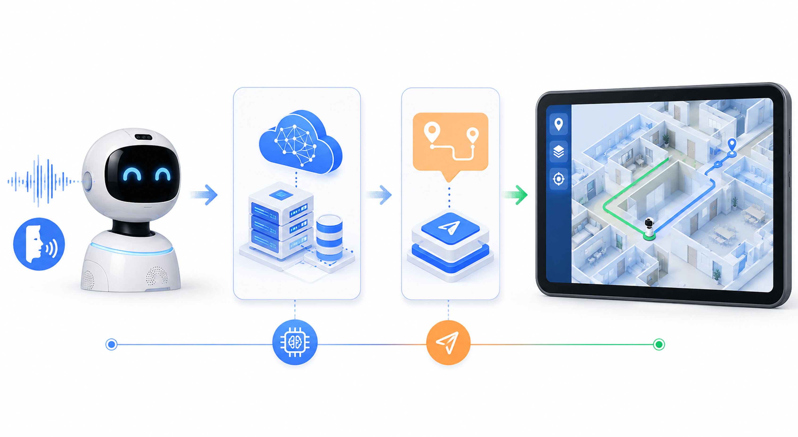
  <br>
  <sub>声控输入、后端智能、结构化工具、地图状态和触控推进共同形成自然导引链路。</sub>
</p>

### 2.6 微信小程序跨端集成

小程序不是截图版，也不是套一个 `5173` 服务。当前路线是微信原生页面 + 地图分包 + 包内 WebGL/Three 场景 + 同步地图数据。首页保留机器人端一致的入口风格，地图页支持真实起终点选择、路线计算、图层和触控。

小程序发布约束：

| 项 | 当前状态 |
| --- | --- |
| AppID | `wx160ad5f2d6c16281` |
| 页面方向 | 横屏 |
| 地图资源 | 包内分包，不依赖 localhost |
| 地图路线 | 使用同步后的 `map-data` 和 `calculateRoute` 规则 |
| 起终点 | 支持常用路线和任意起终点组合 |
| 后端桥 | 支持 `/api/tools`、`/api/realtime`、`navigation_progress` 和 `tool_result` |
| 发布门禁 | `check:miniprogram`、`check:miniprogram:parity`、`check:miniprogram:release` |

<p align="center">
  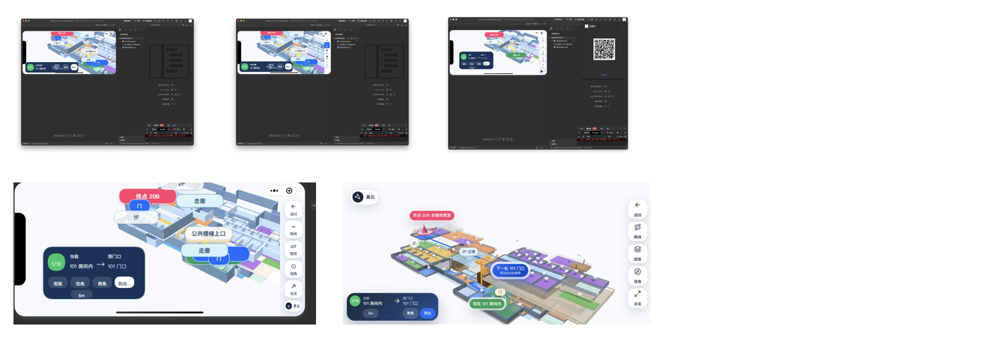
  <br>
  <sub>小程序迭代从 WebView、截图贴图、自绘多边形逐步收敛到发布级 WebGL/Three 路线。</sub>
</p>

### 2.7 实体组件与软硬件协同

实体侧围绕“让数字能力落在机器人上”展开：顶部终端需要适配机器人结构，屏幕角度、安装空间、供电、线缆、散热和现场展示流程都会影响交互效果。软件设计因此保持横屏、低干扰、大触控目标和少层级入口，便于装配后直接演示。

<p align="center">
  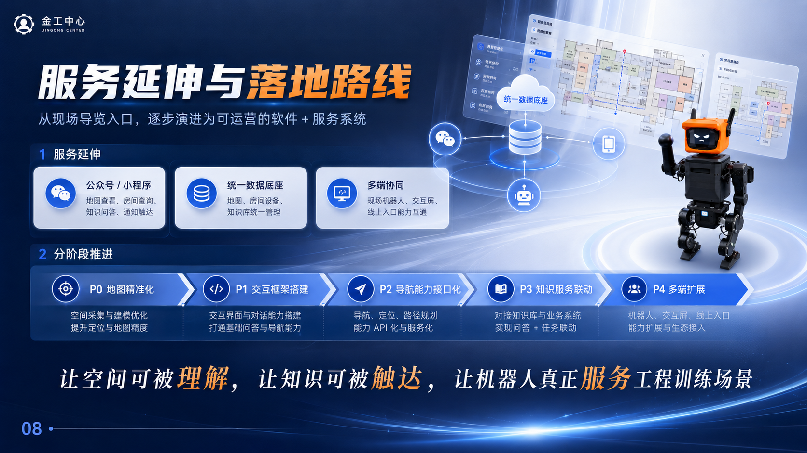
  <br>
  <sub>设计稿中的服务延伸方向对应机器人载体、现场展示、交互终端和后续场景扩展。</sub>
</p>

## 3. 验证过程中发现的问题与迭代

### 3.1 交互终端迭代

早期界面更像桌面端：入口多、浮层重、面板连续滚动、右侧操作不够明确。横屏验证后暴露出这些问题：

| 问题 | 影响 | 迭代结果 |
| --- | --- | --- |
| 待机页信息过多 | 机器人“脸”的感觉被破坏 | 改成纯表情 + 地图 FAB + 抽屉 |
| 浮窗不可关闭或露半截 | 触控端不适合连续滚动 | 面板改为 Material 风格，可关闭、可分页 |
| 对话/专家页机器人遮挡文字 | 回答内容不够清楚 | 机器人移到右下角，回答文字居中优先 |
| URL 只能直达地图 | QA 和后端无法直接验证 chat/expert/listening | 增加 `mode=chat/expert/listening` deep-link |

### 3.2 地图几何迭代

地图问题是整个项目迭代最多的部分。早期先做手工平层地图，随后引入真实 3D 模型、门洞、走廊、楼梯和 202 平台。反复验证后，明确了一个原则：地图不能只是“看起来像楼”，而要成为可计算、可解释、可导航的空间结构。

| 问题 | 根因 | 处理 |
| --- | --- | --- |
| 房间和走廊不清 | 只画房间，没有对未命名空间分类 | 增加 corridor、restroom、service、storage、reserved、support |
| 墙体、门点、房间点漂浮 | marker 和墙体高度散落在渲染逻辑里 | 集中 render policy，普通门点隐藏为热区，关键点才显示 pin |
| 楼梯像碎片 | 楼梯视觉和上下 landing 没有统一 | 重建 landing、梯段、踏步、扶手和上下口配对 |
| 二层与二层半混乱 | 202 平台既不是普通二层，也不能悬空 | 增加二层半平台和下方承托结构 |
| 总览、单层、分层不一致 | 不同视图各画各的 | 统一闭合空间模型，视图只是同一结构的不同表达 |

<p align="center">
  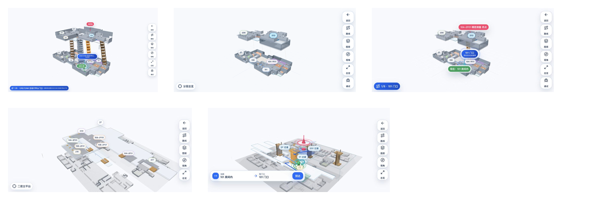
  <br>
  <sub>几何迭代围绕墙体闭合、走廊填充、楼梯实体、202 平台、端点标注和分层视图展开。</sub>
</p>

### 3.3 导航与语音协同迭代

路线最初只负责从起点到终点，后来发现现场用户更需要“下一步应该走到哪里”。因此导航从整体路线升级为节点级导引：

- 当前点、下一门/楼梯/转折点、终点 pin 高优先级显示。
- 边标签不再铺满地图，详细说明放到路线面板。
- 用户到达一个节点后可以手动点击“到达”，也可以通过语音说“下一步”。
- 后端只能播报前端回传的当前段事实，避免自行编造剩余距离或时间。
- 模拟器没有方向传感器时，界面明确提示地图按真北显示。

### 3.4 后端接入迭代

后端接入后，设计文档需要从“前端接收指令”升级到“前后端协同闭环”。验证中重点发现并处理了四类问题：

| 问题 | 处理 |
| --- | --- |
| 智能体容易提到无关模型或平台 | 后端提示词强化身份和场景边界，回答围绕金工小子和工程训练中心 |
| 房间号识别不全 | DuplexKit 房间目录与前端 53 个房间做一致性校验 |
| 导航过程缺少当前段认知 | 增加 `navigation_progress`，后端播报当前段、下一节点、剩余距离 |
| 工具声明可能漂移 | `check:fullstack:contracts` 校验工具、远端、锁定提交和脚本 |

### 3.5 小程序迭代

小程序经历了几条被验证后放弃的路线：

| 尝试 | 放弃原因 |
| --- | --- |
| WebView 打开 H5 | 依赖外部服务和域名，不是打开即用 |
| 静态 PNG / 截图贴图 | 看起来像地图，但不能旋转、缩放、选择和真实寻路 |
| 小程序自绘简化地图 | 功能和移动端差异大，容易回退到旧地图 |
| 包内 WebGL + Three 适配 | 当前发布目标，能复用地图语义和路线规则 |

小程序最终门禁不仅检查页面能打开，还检查禁止 WebView、禁止 localhost、禁止全图 PNG 贴图、支持起终点组合、支持后端 bridge、支持 release AppID 和分包配置。

## 4. 验证效果

### 4.1 当前功能状态

| 模块 | 当前效果 |
| --- | --- |
| 嵌入式终端 | 待机、聆听、对话、专家、地图五类状态可直达验证，横屏布局稳定 |
| 三维地图 | 真实模型 + 80 个空间块 + 53 个门洞 + 4 组楼梯 + 16 条中心线 |
| 路线导航 | 支持起终点、内部楼梯约束、202 二层半、逐段导引、手动/语音推进 |
| 后端 | DuplexKit 锁定远端提交，工具声明、导航事实、房间目录和测试通过 |
| 小程序 | AppID 已配置，包内地图分包，route picker 支持任意起终点组合，release gate 通过 |

### 4.2 最新全栈验证

最新验证命令在干净 worktree 执行：

```bash
npm run check:fullstack:release
```

通过内容包括：

| 检查 | 结果 |
| --- | --- |
| `check:fullstack:contracts` | DuplexKit 远端、分支、HEAD、锁定文件一致 |
| `check:map` | 53 房间、80 空间、53 门洞、4 楼梯、16 中心线、对齐误差 0 |
| `check:miniprogram` | 小程序壳、地图入口、MapDirect、后端 bridge 通过 |
| `check:miniprogram:parity` | 小程序发布级一致性门禁通过 |
| `npm run build` | TypeScript + Vite 生产构建通过 |
| `check:backend` | DuplexKit typecheck、6 个测试文件、49 个测试和导航 smoke 通过 |
| `check:miniprogram:release` | AppID、发布配置和正式限制门禁通过 |

后端导航 smoke 返回事实：

| 字段 | 结果 |
| --- | --- |
| 当前段 | `101 门口 -> 走廊入口` |
| 下一节点 | `走廊入口` |
| 用户动作 | `到达该节点后点下一步，或说下一步` |
| 手动推进 | true |
| 语音推进 | true |
| 方向状态 | 模拟器无方向传感器，地图按真实北向显示 |

### 4.3 小程序发布验证

微信开发者工具 preview 使用 AppID `wx160ad5f2d6c16281` 通过。包体记录：

| 包 | 大小 |
| --- | --- |
| 总包 | 2.5 MB |
| 主包 | 1.1 MB |
| 地图分包 `/packages/map/` | 1.4 MB |

小程序侧重点不是“截图像不像”，而是能否真正复用地图能力：

- 首页可进入地图、对话和专家页。
- 地图页支持真实 WebGL 场景，不依赖 `5173`。
- 起终点选择不局限于固定 demo，53 个房间的全量组合路径覆盖通过。
- `108-lobby -> 202-5` 等路线能经过公共楼梯和 202 平台。
- 小程序后端 bridge 能响应 `navigation.next` 等工具请求并回传结果。

### 4.4 Android / Tauri 验证

Android v36 作为移动端基准，验证了横屏启动、地图进入、图层面板、路线面板、2D / 3D 视角、触控操作和 arm64 构建：

| 项 | 记录 |
| --- | --- |
| APK | `jingong-xiaozi-0.1.0-map-height-v36-arm64-test-signed.apk` |
| ABI | `arm64-v8a` only |
| 签名 | apksigner v2/v3 pass |
| 冷启动 | 4584 ms |
| `cargo check` | pass |
| Android 安装 | pass |

当前最新文档更新前也执行了 `npm run check:fullstack:release`；之前一次功能收口还执行过 `cd src-tauri && cargo check`、Playwright 横屏截图、路线推进和微信 DevTools preview。

### 4.5 结果评价

最终系统已经从“地图页面”升级为“机器人交互终端 + 三维空间导航 + 多模态智能后端 + 微信跨端入口”的完整闭环：

- 用户看到的是机器人状态和清晰路线，而不是调试按钮或后端参数。
- 地图知道房间、走廊、门、楼梯和二层半平台之间的关系。
- 后端知道自己不能猜路线，需要消费应用端回传的当前段事实。
- 小程序不是演示截图，而是按发布门禁约束的自包含入口。
- 文档、代码、验证脚本、后端锁定提交和截图证据已经形成可追溯链路。

## 5. 后续交付建议

| 事项 | 建议 |
| --- | --- |
| 真机接入 | 在真实机器人上验证麦克风、扬声器、方向传感器、屏幕亮度和触控边缘 |
| 小程序发布 | 使用微信开发者工具上传，提交前再次运行 `check:miniprogram:release` 和真机预览 |
| 房间语义 | 继续用 CAD / SKP / 现场复核替换 `source: inferred` 门洞 |
| 首屏性能 | 后续可按地图和问答拆包，降低 Vite 大 chunk |
| 展示材料 | 汇报时按四条工作线讲：终端、实体、多模态、后端；地图作为终端和后端共同验证点 |

## 附件

| 附件 | 内容 |
| --- | --- |
| [资产证据索引](appendix/assets-index.md) | 参考图、PDF/PPT、QA 截图、模型、APK、小程序和生成图资产 |
| [后端接口约束摘要](appendix/backend-contract-summary.md) | 状态指令、地图参数、音频链路和接入验收 |
| [地图几何与导航校验](appendix/map-geometry-validation.md) | 空间语义、模型校准、门洞、楼梯、202 二层半和路线规则 |
| [发布与验证记录](appendix/release-verification.md) | H5、Android、小程序、构建、签名和剩余风险 |
| [生成图提示词规范](appendix/generated-image-guidelines.md) | 参考图角色、事实锁、禁止项、分辨率实测和弃用规则 |
